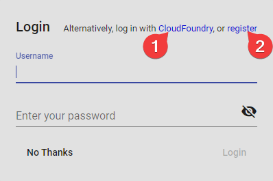
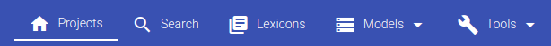
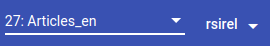
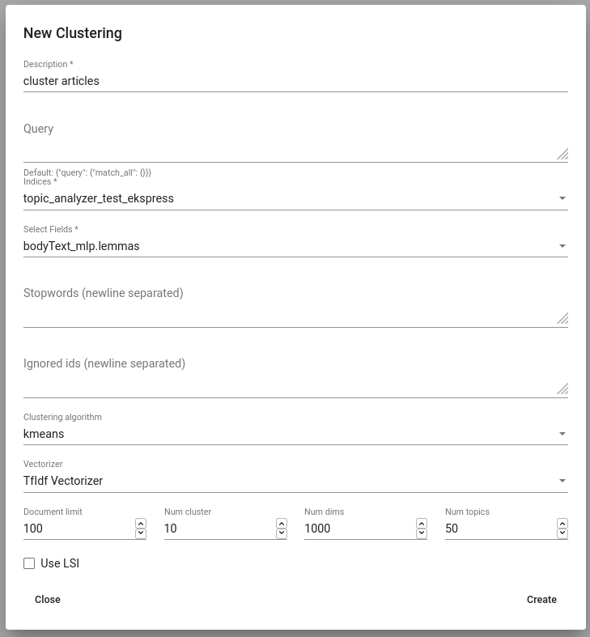
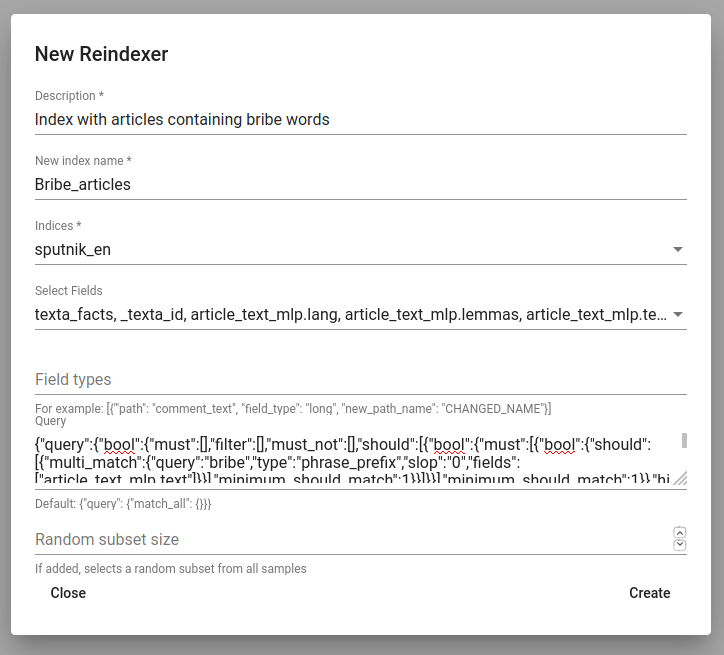
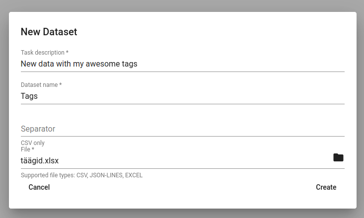

Tutorial: Using Toolkit via GUI
===============================

This is documentation is for TEXTA Toolkit version 2 GUI backed with TEXTA Toolkit's RESTful API.

Registration & Login
--------------------

Since TEXTA Toolkit is a web application, we have to navigate to the corresponding address in our browser (e.g. `http://localhost/`).
We are welcomed by a login page as depicted in Figure 1.

.. _figure-1:

    Figure 1. *Login Screen at Startup*
    
One can also register new users using the registration screen:

.. _figure-2:

.. figure:: images/register.png

    Figure 2. *Registration Screen*

.. note::

    When running for the first time, check the default superuser account **admin** created during installation.

After login have several navigation options in the upper panel.
We can see our projects (also projected as the home page) and we can work with our projects via :ref:`Search <search>`, :ref:`Lexicons <lexicons>`, :ref:`Models <models>` and :ref:`Tools <tools>`.

.. _figure-3:

    Figure 3. *Top Panel for Navigation*

Health of Toolkit
-----------------

On the **Projects page** (also Toolkit's home page) we can see technical information about TEXTA Toolkit's server on the right.
There are several labels that indicate the state of Toolkit and the host machine its working on (Figure 4):

.. _figure-4:

.. figure:: images/server_status.png

    Figure 4. *Toolkit Status*

Managing Projects
------------------

Creating a Project
+++++++++++++++++++

In order to play with the data, we need to create a new project.
We can create a project by clicking the **+ CREATE** button at the bottom of the page.
We can then give it a title, select users who can work on the project and, of course, select datasets (Elasticsearch :ref:`indices <index_concept>`) for the project. 

After the project is created, we can see the new project in the list and can change its datasets and user access via the **Edit** button.

Using a Project
+++++++++++++++++++

In order to work with our project (search info, train taggers) we have to select it from the upper panel next to our username:

.. _figure-5:

    Figure 5. *Project Selection*

.. note::
    Only one project can be activated at a time.
    
    Each project can have one or more datasets (Elasticsearch indices).
    
    Project resources are shared among the users with access to the project.

Search: Exploring the Data
--------------------------

The Search application is responsible for both creating the searches defining subsets of documents for Toolkit's other applications and browsing-summarizing the data.

.. note::
	In order to use **Search**, project must be selected in upper panel.

Search's graphical interface consists of serveral important panels, which are depicted in Figure 6.
We can collapse or open the panels by clicking on the arrow in the corner.

.. _figure-6:

    Figure 6. *Search Panel*
    
        1. :ref:`Current Search <currentsearch>`
        2. :ref:`Saved Searches <savedsearches>`
        3. :ref:`Aggregations <aggregations>`

.. _currentsearch:

Current Search
++++++++++++++

Data browsing and summarization depend on searches. Search consists of a set of constraints on :ref:`field <field_concept>` values. We can define our constraints on the data using the *Current Search* panel.
Without saving the constraints, we are in a “test mode”, which means that we can use the search in real time, but we cannot use the search in other tools.
After saving the search, it is available also to other tools.

In order to add a constraint, we must first choose one or several fields. After the field is selected, we can then specify which textual tokens (words or word parts) should or must occur in the interested document subset.

We must notice that the search will be done on the Project's dataset chosen in the upper panel.

Suppose we are interested in finding all the documents which contains “bribery” and “official” from a text.
Figure 7 shows how we have defined that we want to find all the documents which contain “bribery” and “official” in the article_text_mlp.text field:

.. _figure-7:

.. figure:: images/search_constraints.png

    Figure 7. *Example Search Constraints*

Searches have several parameters to consider:

* We can also choose ‘or’ or ‘not’ under the Operator. In this case we either get documents containing at least one of the words (‘or’) or definitely not containing the words listed (‘not’).

* We can choose from several match types. Type “word” means that we want to find exact matches of the word(s) written and “phrase” means that we want to find exact matches of the phrases we are looking for, whereas “Phrase prefix” matches prefixes. This means suffixes may differ: for example searching for ‘bribe’ will find ‘bribetaking’, ‘bribers’, ‘bribery’ and other words starting with ‘bribe’. 'regex' takes the input as `a regular expression <https://www.rexegg.com/regex-quickstart.html>`_ and searches document accordingly. For example 'bribe.{0,2}' will find 'bribe' and 'bribery', but not longer words. If we have a big list of words we want to search for, we can extend the field searcher's panel.

* We can also use Slop. Via Slop we can define up to how many words can be between the two words we wrote on one row in case the range is important for us.

Should we be interested in more detailed searches, we can add more constraints like the previous ones via **Add Filter** button.
For example, we can also search documents in a certain date range in case we have a proper preprocessed date field.

If we click on “Search” button, we will see the matching data in a tabular form (see Figure 8), where layered features share feature name’s prefix, and matches are highlighted in pink.
The results might be updating while modifying the filters.

.. _figure-8:

.. figure:: images/search_results.png
    :width: 100 %

    Figure 8. *Example Search Results*

If there are too many features (columns), we can hide or show them from the drop-down menu in the down left corner. We can select or deselect all of them together (*Select all*) or by clicking on them separately. We can also hide or get back the Searcher's panels with *Toggle drawer* button. We can browse through Searcher's results with the arrows in the bottom right. We can also choose how many items per page would we want to see.

.. _figure-9:

.. figure:: images/search_results_toggle.png

    Figure 9. *Select Fields for Search Results*

After we have come up with a suitable search, we can save it for later use by clicking on the **disk** icon up-right in the Current Search panel. The **eye** icon next to the disk icon shows us the actual Elasticsearch query we built by choosing the Operators and words to search for.

.. _savedsearches:

Saved Searches
++++++++++++++

After saving a search, it becomes available for using in Toolkit's applications.
Now, whenever we check it, we can use it to browse data or apply in aggregations.
We can also send our saved search to other users who have the permission to our project with a copied url.
This opens the saved search under the Current Search for the other user.
We can also open our saved search in the Current Search simply by clicking on it.

.. _aggregations:

Aggregations: Summarizing the Data
++++++++++++++++++++++++++++++++++

As fun as browsing through the data is, it is not always enough. Sometimes we want to get an overview of our data, such as topics over time or word distributions. Searcher allows to do all of that and more through the “Aggregations” panel.

Aggregations have two components - data and features it aggregates over. It will aggregate over the dataset we have under the Current Search. We can also exclude current search (meaning that 'Aggregate over all data except the one we have currently active') and choose the aggregation size. By defining a feature, we can group by that feature and get category counts. For example, lets assume we are interested in seeing how are the top words distributed in our sample data defined by our “bribe” search. For that we simply click on our bribe search under Saved Searches to get it as the current search.

.. note::

    **How are the significance scores calculated?**
	The numbers returned for scores are primarily intended for ranking different suggestions sensibly rather than something easily understood by end users. The scores are derived from the doc frequencies in foreground and background sets. In brief, a term is considered significant if there is a noticeable difference in the frequency in which a term appears in the subset and in the background. The way the terms are ranked can be configured, `see "Parameters" section <https://www.elastic.co/guide/en/elasticsearch/reference/current/search-aggregations-bucket-significanttext-aggregation.html>`_.

One cool thing we can also do, is to visualize the frequency of texts with searched words in it on a timeline. We can do that if we have a proper date field (in Texta date format) in our data. Here we can visualize when were the words 'bribe', 'bribery' and 'bribed' used most frequently in our dataset.

We can also aggregate over :ref:`texta_facts <texta_fact>` field in order to see the top entities under some tag. If we click on the black diagram button, we can scroll through the results. We see as many entities as we chose for our aggregation size.

.. _lexicons:

Creating Topic-related Lexicons
-----------------------------------------

In order to build lexicons, we must have :ref:`Embedding <embedding_concept>` model :ref:`previously trained <embedding>` . We can start creating topic-related lexicons.

Let’s create a lexicon that contains verbs accompanied with “bribery”.

After clicking on the newly created lexicon, we have to provide some seed words like 'accuse'.

The process of creating (or expanding) the lexicon is iterative. We keep asking for suggestions and from those we have to pick the ones that make sense to us. We keep asking for suggestions until we get no more meaningful responses. Words we didn't choose appear under the lexicon as negative words. These are considered as the opposite of the meanings we are looking for. We can erase words from the negative words list simply by clicking on it. 

To add a suitable word to the lexicon, we simply have to click on it. If we want to delete something we already chose we can erase the verb from the list.

When we’re ready, we can save the lexicon.

.. _models:

Statistical Language Modelling
-------------------------------

Under the *Models* option on the upper panel we can use different taggers and create embeddings.

.. _embedding:

Embedding
++++++++++

:ref:`Embeddings <embedding_concept>` are basically words converted into numerical data (into vectors) that are more understandable and usable for the machine than plain strings (words). With these vectors created, we can compare words and find similar ones. We need embeddings to create, for example, :ref:`lexicons <lexicons>`. Texta Toolkit uses word2vec embeddings with `collocation detection <https://radimrehurek.com/gensim/models/phrases.html>`_. It means that the vectors are created on words and phrases. Phrases are chosen with collocation detection which finds often together occuring words and marks them as phrases. 

We can create a new embedding by clicking on the '+ CREATE' button in the bottom-left. Then we must choose the name for the new embedding (*Description*). If we leave *Query* empty, it will take all data in the active project as a input. We can also use saved searches as our desired input. Then we must choose the fields the embedding learns from. Embedding needs textual data, so we have to choose fields with text or lemmatized text in it. One field is also enough. Usually lemmatized texts are preferred, especially with morphologically complex languages, because it increases the frequency of some words (*eaten*, *eats* and *ate* will change to it's lemma *eat*).

Then we have to choose the number of dimensions. That means the length of the vectors created. 100-200 dimensions is usually a good place to start with. The minimum frequency defines how many times a word or a phrase has to occur in the data in order to get it's very own word/phrase vector. Rare words/phrases won't have very informative and usable vectors. Minimum frequency of 5 can be left as default if we are not sure of what to use.

Keep in mind that the bigger the data, the better results!

After creating the new embedding we can view the learning process and results in the embeddings' table. We can see which user created this embedding in this project, the name of the embedding model, field(s) it was trained on, the time it took to train, dimensions, minimum frequency and created vocabulary size. By clicking on the new model's row we can see similar info again. 

Three dots under *Edit* gives us access to deleting the embedding model or using *Phrase*. *Phrase* is a feature that helps us to check which phrases occur in the embedding model as vectors on their own. It outputs the words and connects phrases with '_'. For example, we can create an embedding model with our saved search 'bribery' (figure 10). If we leave the query empty, the model will be trained on the whole dataset.

.. _figure-10:

.. figure:: images/create_embedding.png

    Figure 10. *Create embedding with saved search*

.. _texttaggers:

Tagging the Data
----------------

Different Taggers in Texta Toolkit are classification models which can classify new data with the label/class the model is trained on. We can apply the tagger via API. 

We have two taggers:

	1. :ref:`Tagger Groups <tagger_group_concept>`
	2. :ref:`Taggers <tagger_concept>`

Only *Tagger* can be trained with saved searches. Others learn their models on tags in the dataset. Below we will see how to train them.

.. _taggers:
	
**Training Taggers**

:ref:`Tagger <tagger_concept>` operates on saved searches and uses machine learning. We can create a new Tagger model by clicking on the '+CREATE' button in the bottom-left. Then we must choose the name for the new Tagger (*Description*) and the fields the model learns from. If we choose two, the fields are just concatenated together before the learning process. One field is also enough. Usually lemmatized texts are preferred, especially with morphologically complex languages, because it increases the frequency of some words (*eaten*, *eats* and *ate* will change to it's lemma *eat* and are dealt as one word).

If we leave *Query* empty, it will take all data in the active project as a input. We can also use saved searches as our desired input. This input will be our positive examples - later on we want to tag data similar to this one.
	
By setting these three, we can now train a classifier. However, we can also fine-tune the classifier by changing additional parameters such as
Vectorizer (Hashing Vectorizer, Count Vectorizer, Tfldf Vectorizer - read more about them `here <https://scikit-learn.org/stable/modules/feature_extraction.html>`_) and Classifier (`Logistic Regression <https://scikit-learn.org/stable/modules/linear_model.html#logistic-regression>`_, `LinearSVC <https://scikit-learn.org/stable/modules/generated/sklearn.svm.LinearSVC.html>`_). We might get an error with LinearSVC in case we don't have enough data in the search.
We can set negative multiplier to change ratio of negative examples. We can use maximum sample size per class in case we want to limit the size of data the model trains on.

Then we can hit create and see the training process and result of the tagger.

.. _figure-11:

.. figure:: images/create_tagger.png

    Figure 11. *Creating Bribe_tag tagger*

Whenever we create a new Tagger model, we can track it's progress from the table under *Task*. If we click on the job, we can see all the training info, how long did it took, and check how successful it was. Let's not forget that:
	1. Recall is the ratio of correctly labeled positives among all true positives.
	2. Precision is the ratio of correctly labeled positives among all instances that got a positive label.
	3. F1 score is the harmonic mean of these two and should be more informative expecially with unbalanced data.

If we click on the three dots under *Edit*, we can see a list of extra actions to use.

*List features* lists the word-features and their coefficients that the model used. Works with models that used Count Vectorizer or Tfldf Vectorizer since their output is displayable.

*Retrain tagger* retrains the whole tagger model with all the chosen parameters. It's useful in case our dataset changes or we have added some stop words.

*Stop words* is for adding stop words. Stop words are words that the model do not consider while looking for clues of similarities. It is wise to add most frequent words in the list like *am*, *on*, *in*, *are*. Separate the words with space (' '). 

*Tag text* is to check how does the model work. If we click on that a window opens. We can paste there some text, choose to lemmatize it (necessary if our model was trained on a lemmatized text) and post it. We then recieve the result (True if this text gets the tag and False otherwise) and the probability. Probability shows how confident is our model in it's prediction. 

*Tag doc* is similar to *Tag text*, except the input is in the json format. 

*Tag random doc* takes a random instance from our dataset, displays it and returns the result and the probability of this result being correct. 

*Delete* is for deleting the model.

In the table view we can also select several models and delete them all at once by clicking on the dustbin button next to the *+CREATE* button in the bottom-left. If we have several models, we can search for the right one by their description or task status. If we have models on several pages we can change pages in the bottom-right.

.. _figure-12:

.. figure:: images/tagger_result.png
    :width: 100 %

    Figure 12. *Bribe_tag tagger*

.. _taggergroups:

**Training Tagger Groups**

Tagger Group is for training multible classes at once and it also uses tags in the dataset given.

.. note::

    **How do Tagger and Tagger Groups differ?**
	One model predicts whether a text is positive (True) or negative (False). That is, whether this text get's the label or not. Tagger trains only one model and predicts whether a text is similar to the query/dataset it was trained on or not.
	Tagger Group trains several models at once. That means, it can predict several labels at once. Tagger Group trains on facts. We can have several values under a certain fact and for each value (if it has high enough frequency (*Minimum sample size*) a model is trained.

We can create a new Tagger Group model by clicking on the '+CREATE' button in the bottom-left. Then we must choose the name for the new Tagger Group (*Description*), the facts the model starts to learn on and the minimum sample size.

Our input will be the data under the project that is active (we can check it on the blue panel up-right). We have to select the fields the model learns from. If we choose two, the fields are just concatenated together before the learning process. One field is also enough. Usually lemmatized texts are preferred, especially with morphologically complex languages, because it increases the frequency of some words (*eaten*, *eats* and *ate* will change to it's lemma *eat* and are dealt as one word).

There's also an option to include our existing :ref:`embeddings <embedding>` into the training. 

Then we need to fine-tune the Tagger Group's classifiers by changing additional parameters such as
Vectorizer (possible feature extractors are: Hashing Vectorizer, Count Vectorizer, Tfldf Vectorizer - read more about them `here <https://scikit-learn.org/stable/modules/feature_extraction.html>`_) and Classifier (`Logistic Regression <https://scikit-learn.org/stable/modules/linear_model.html#logistic-regression>`_, `LinearSVC <https://scikit-learn.org/stable/modules/generated/sklearn.svm.LinearSVC.html>`_). We might get an error with LinearSVC in case we don't have enough data in the search.
We can set negative multiplier to change ratio of negative examples in the training set. We can use maximum sample size per class in case we want to limit the size of data the model trains on.

.. _figure-13:

.. figure:: images/create_tagger_group.png

    Figure 13. *Creating a Tagger Group*

Then we can hit create and see the training process and result of the tagger as seen in Figure 14.

.. _figure-14:

.. figure:: images/created_tagger_group.png
    :width: 100 %
    
    Figure 14. *Created Tagger Group*

Whenever we create new Tagger Group models, we can track it's progress from the table under *Task*. If we click on the job, we can see all the training info, how long did it took, and check how successful it was. Let's not forget that:
	1. Recall is the ratio of correctly labeled positives among all true positives. Avg.recall is the average of all the models' recalls.
	2. Precision is the ratio of correctly labeled positives among all instances that got a positive label. Avg.precision is the average of all the models' precisions.
	3. F1 score is the harmonic mean of these two and should be more informative expecially with unbalanced data. Avg.F1_score is the average of all the models' F1 scores.

If we click on the three dots under *Edit*, we can see a list of extra actions to use.

*Models retrain* retrains all of the Tagger Group models with all the chosen parameters. It's useful in case our dataset changes or we have added some stop words.

*Models list* displays us the models the Tagger Group trained. We can inspect which kind of labels were trained.

*Tag text* is to check how does the model work. If we click on that, a window opens. We can paste there some text, choose to lemmatize it (necessary if our model was trained on a lemmatized text) and choose to use NER and post it. We then recieve the result (all the labels which model predicted True for this text) and the probability of this label being true. Probability shows how confident is this model in it's prediction. *Number of similar documents* is the number of most similar documents to the document in question. Tags given to these documents are tested on the document to be tagged.

*Tag doc* is similar to *Tag text*, except the input is in the json format. *Number of similar documents* is the number of most similar documents to the document in question. Tags given to these documents are tested on the document to be tagged.

*Tag random doc* takes a random instance from our dataset, displays it and returns the positive results of our models and the probability of these results being correct. 

*Delete* is for deleting the model.

In the table view we can also select several Tagger Groups and delete them all at once by clicking on the dustbin button next to the *+CREATE* button in the bottom-left. If we have several Tagger Groups, we can search for the right one by their description or task status. If we have models on several pages we can change pages in the bottom-right.

.. _topic_analyzer:

Using Topic Analyser
--------------------

Topic Analyzer is a tool that helps us to find groups of similar documents from the data and transform these groups into labels.

**Grouping the data**

To create a new grouping (or clustering, as we name it) navigate to Models -> Clustering and click "Create". Similarly to Tagger Group object, you have to give it a name (*Description*) and select indices and fields based on which the grouping will be done. Additionally one can restrict the set of documents to be used in clustering by specifying the filter with a *Query* parameter. 

If desired, one can do some fine-tuning as well by choosing clustering algorithm and vectorizer and specifying the number of clusters (*Num clusters*) and the number of document vector dimensions (*Num dims*). 

.. note::

	**How to choose the number of clusters?**
	
	General advice would be to better have too many clusters than too few. Think about how many documents you are planning to cluster and choose the number so that the average cluster is small enough to inspect it manually with ease. For example, if you are going to cluster 1000 documents to 50 clusters then average cluster would contain 20 documents. 

Instead of using document-term matrix for clustering, we can also use compressed approximation of this matrix (with parameter *Use LSI*) which is constructed before the clustering process begins. However, LSI also requires the number of topics (dimensions in low-rank matrix) to be specified (*Num topics*).

In some cases we may already have some knowledge about the data that we are about to cluster. For example, we may be aware of some domain-specific stopwords which we would like to ignore. As name already suggests, these can be listed in the field *Stopwords*. 

.. _figure-15

    Figure 15. *Creating a Clustering*

**Evaluating clusters**

To see the clusters, click *View clusters* under Actions. This view gives us an overwiew about obtained clusters. For each cluster the document count and average cosine similarity between its documents is shown. Additionally, a list of significant words for each cluster is given - it is a list of words that, when compared to other documents, appear notably often in documents which belong to that cluster.

.. _figure-16

.. figure:: images/clusters_view.png
    :width: 100 %

    Figure 16. *Clusters view*

.. note::

	**Interpreting document count**
	
	Cluster with significantly larger document count often indicates that the clustering algorithm has failed to separate these documents by the topic. It doesn't necessarily mean that the clustering process in general has been unsuccessful as often it is impossible to cluster all documents perfectly. However, you still might want to take a closer look to such clusters as there may be other reasons for such results as well. For example, the documents in that cluster may contain similar noise or stopwords that makes them artifically similar to each other. Sometimes increasing the number of clusters might help as well.

	**Interpreting average similarity**
	
	Average similarity is an average cosine similarity between all the documents in the cluster. It ranges between 0 and 1 and higher score indicates that the documents in that cluster are more similar to each other. However, the score has some disadvantages. For example, when a cluster contains 9 documents that are very similar to each other and 10th document is very different from all others, then the score might appear low althought fixing that cluster would be very easy.

To see content of a cluster, simply click on a cluster that is in your interest, this opens you a Cluster Details view.

**Operations with cluster**

Cluster Details view allows us to inspect the actuals documents belonging to a cluster.

If we are satisfied with what it contains, we can tag the content by click "Tag" button. This operation adds a texta_fact to each of the document in the cluster, with specified name and a string value. From now on, these documents will be ignored in further clustering processes.

If not satisfied, we probably want to do some corrections in the cluster content manually, that is, remove some documents from it. This can be done by selecting the documents that we want to remove and clicking on trash bin icon. Note that these documents will not be ignored in further clustering process.

We could also be interested in whether there is more documents in the index that are similar to the ones in given cluster. If indeed there is, we might want to add those documents to the cluster as well, so we could tag them all together. 

To query similar documents, click on a "More like this" button. In the opened view, select document which you would like to add to the cluster and click on a "+" button.

.. _figure-17

.. figure:: images/cluster_details_view.png
    :width: 100 %

    Figure 17. *Cluster details view*

.. _tools:

.. _reindexer:

Reindexing the Data
-------------------

Reindexer is a useful tool for reindexing Elasticsearch :ref:`indices <index_concept>`. We can think of index as our dataset. With reindexer we can remove unwanted fields, change the type of the fields (if we have a field with text value type but actually contains dates, we can change the type to date and use it for our aggregation). 

We can create a new index by clicking on the '+CREATE' button in the bottom-left.

*Description* is the description of new reindexing job.

*New index name* is the name for our new index.

*Indices* are all the indices that we want in our new index.

*Field types* are for changing the type and/or the name of our field(s).

We can use *Query* for adding only certain search results to our new index.

*Random subset type* helps us to create an index which contains only certain amount of samples (rows). We can use this in case we want to play with a smaller subset before we apply our tools on a bigger one.

.. _figure-18:

    Figure 18. *Creating a new index*
    
    
.. _reindexer:

Uploading the Data
------------------

We can upload new data via Dataset Importer under Tools

.. 
    unless we want to do it via API-> viide.

.. _figure-19:

    Figure 19. *Importing a new dataset*
    

.. 
    _neurotaggers:

    **Training NeuroTaggers**

    NeuroTagger operates on tags and uses neural networks. This means that we must already have our own tags created in the dataset in order to train it. If we don't know what to use, we can leave all of the parameters by default. But we can also try some parameter tuning.

    We definetly have to name the model (*Description*), select fields it will be trained on (*Select Fields*, multible fields will be concatenated together) and choose the tag it will be trained on (*Fact Name*). 

    NeuroTagger enables us to use `Feedforward Neural Network <https://en.wikipedia.org/wiki/Feedforward_neural_network>`_ (*fnn*), `Convolutional Neural Network <https://en.wikipedia.org/wiki/Convolutional_neural_network>`_ (*CNN*), `Neural Network with Gated Recurrent Unit <https://en.wikipedia.org/wiki/Gated_recurrent_unit>`_ (*gru*), `Neural Network with Long Short-Term Memory <https://en.wikipedia.org/wiki/Long_short-term_memory>`_ (*lstm*), Convolutional Neural Network with Gater Recurrent Unit (*gruCNN*) or Convolutional Neural Network with Long Short-Term Memory (*lstmCNN*).
    
    Parameters we can play with are as follows:
    
    *Validation split* gives the fraction of the data that will be used as the validation data (test set).
    
    *Score threshold* chooses the relevance of the documents that are taken into count. If the score goes below the threshold, no more docs are added.
    
    *Sequence length* is the length of the feature vectors.
    
    *Maximum sample size* per class. TODO
    
    *Negative Multiplier* changes the ratio of negative examples.
    
    *Num Epochs* how many times the network goes trough the dataset.
    
    *Vocab size* is the vocabulary size of the neural network. TODO
    
    *Min fact doc count* TODO
    
    *Max fact doc count* TODO
    
    After choosing the mandatory fields and tuning the parameters we can hit create and see the training process and result of the NeuroTagger.
    
    Whenever we create a new NeuroTagger model, we can track it's progress from the table under *Task*. If we click on the job, we can see all the training info, how long did it took, and check how successful it was. Let's not forget that:
    1. Training accuracy is the ratio of correctly labeled instances among all instances in the training set.
    2. Training loss is the ratio of wrongly labeled instances among all instances in the training set.
    3. Validation accuracy is the ratio of correctly labeled instances among all instances in the test set.
    4. Validation loss is the ratio of wrongly labeled instances among all instances in the test set.
    
    If we click on the three dots under *Edit*, we can see a list of features to use.
    
    *Tag text* is to check how does the model work. If we click on that a window opens. We can paste there some text, choose to lemmatize it (necessary if our model was trained on a lemmatized text) and post it. We then recieve the result (True if this text gets the tag and false otherwise) and the probability. Probability shows how confident is our model in it's prediction. 
    
    *Tag doc* is similar to *Tag text*, except the input is in the json format. 
    
    *Tag random doc* takes a random instance from our dataset, displays it and returns the result and the probability of this result being correct. 
    
    *Delete* is for deleting the model.
    
    In the table view we can also select several models and delete them all at once by clicking on the dustbin button next to the *+CREATE* button in the bottom-left. If we have several models, we can search for the right one by their description or task status. If we have models on several pages we can change pages in the bottom-right.