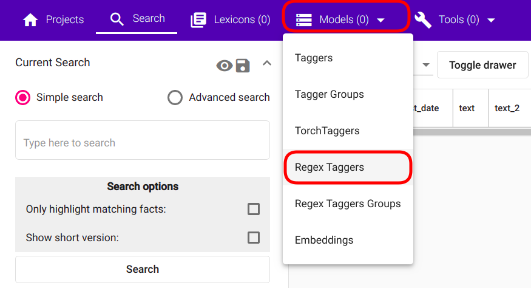
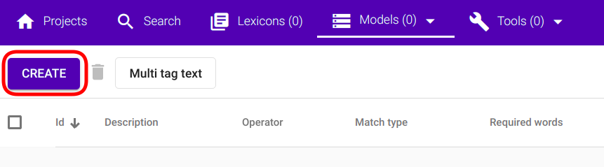
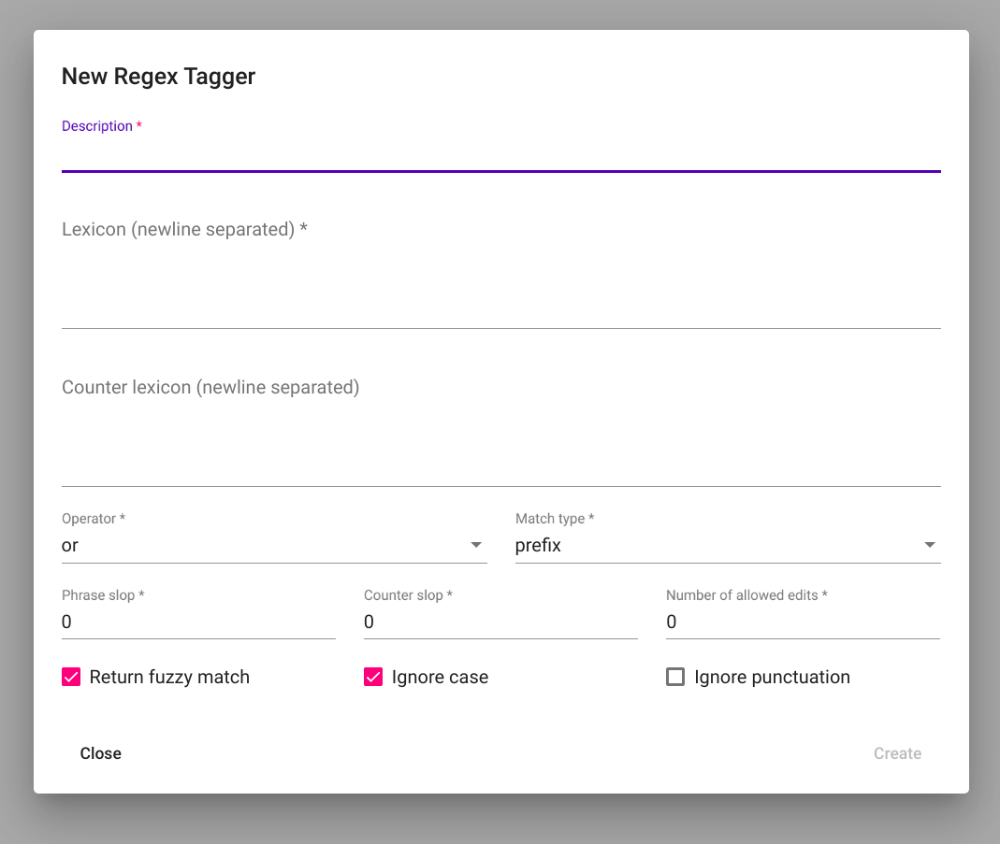
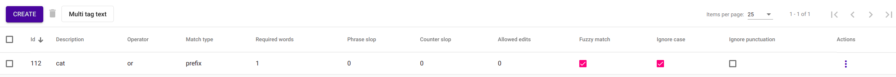

`EN <https://docs.texta.ee/v2/regex_tagger.html>`_
`ET <https://docs.texta.ee/v2/et/regex_tagger.html>`_

#############
Regex Tagger
#############

:ref:`Regex Tagger <regex_tagger_concept>` is a tool for tagging texts based on pattern matches.

**Terminology**

To avoid misinterpretation, let's first define the meanings of "word" and "lexicon entry" in the scope of Regex Tagger.

=======================  =========================================================================================================================================  ===========================================
Termin                          Definition                                                                                                                                 Examples
=======================  =========================================================================================================================================  ===========================================
**word**                  String consisting of non-whitespace characters. NB! regex whitespace wildcards are in this case included as non-whitepace characters!      "cats", "house", "\\d\\s*cat\\w*"
**lexicon entry**         One entry in a lexicon. Lexicon entry can either be a single word, multiple words separated by whitespaces, or a regex pattern\*.          "cat", "dogs cats hats", "\\d\\s*cat\\w*"
=======================  =========================================================================================================================================  ===========================================

\* supports Python Regex syntax.

Creation
******************

Parameters
===========

**description**:
	Name of the Regex Tagger, which is also used as name of the tag while tagging the documents

**lexicon**:
	List of lexicon entries to match (as comma-separated strings in API and newline-separated strings in GUI)

**counter_lexicon**:
	List of nullifying lexicon entries.

**operator**:
	Logical operator for matching words in the lexicon.

	Supported options:
		or:
			return positive result if at least one lexicon entry is found
		and:
			return positive result only if all lexicon entries are found (PS! pay attention to *required_words* parameter!)

**required_words**:
	Required minimum ratio of detected lexicon entries to all the lexicon entries for a positive result.

**match_type**:
	How the lexicon entries should be matched.

	Supported options:
		prefix:
			matches all strings starting with lexicon entities (to the first whitespace)

		exact:
			detects only exact matches to the lexicon entities
		subword:
			matches all entities containing lexicon entities as subentities

**phrase_slop**:
	Number of non-lexicon words allowed between lexicon entry words.

**counter_slop**:
	Number of non-lexicon words allowed between main lexion entries and counter lexicon entries.

**return_fuzzy_match**:
	If set true, return the whole string sequence matched instead of the original lexicon entry.

**n_allowed_edits**:
	Number of allowed character changes between lexicon entry and matched string sequence. One edit is considered as one of the following:
		- missing a character ("cat" -> "ct")
		- adding a character ("cat" -> "catt")
		- substituting a character ("cat" -> "kat")

**ignore_case**:
	If set true, ignore case while detecting matches.

**ignore punctuation**:
	If set true, ignore end-of-sentence characters between lexicon entry words and/or counter lexicon entries and lexicon entries. Otherwise

GUI
==============

For creating a new Regex Tagger model, navigate to `"Models" -> "Regex Taggers"` as seen in :numref:`regex_tagger_navigation`.

.. _regex_tagger_navigation:

	*Regex Taggers navigation*

If the navigation is successful, you should see a panel similar to :numref:`regex_tagger_create_button` with `"Create"` button in the top left corner of the page.

.. _regex_tagger_create_button:

	*Regex Tagger creation button*

Clicking on the `"Create"` button opens a modal window with text `"New Regex Tagger"` as depicted in :numref:`regex_tagger_new_regex_tagger`.

.. _regex_tagger_new_regex_tagger:

	*Empty Regex Tagger creation view*

Fill the required fields as instructed in TODO and click on the `"Create"` button in the bottom right corner of the window (:numref:`regex_tagger_create_view`).

.. _regex_tagger_create_view:
.. figure:: images/regex_tagger/regex_taggers_create_2.png
	:width: 500pt

	*Filled Regex Tagger creation view*

The created Regex Tagger can now be seen as the first (or only, if no previous Regex Taggers exist under the project) row in the table of Regex Tagger models (:numref:`regex_taggers_list`).

.. _regex_taggers_list:

	*List of Regex Taggers.*

API
==============

# TODO

Usage
********

The following section covers all functions supported by Regex Tagger. PS! Some of the functions can only be applied through API as they have no meaningful usage scenarios in GUI.

GUI
====

Tag Text
-----------

Tag Random Doc
----------------

Delete
--------------

Edit
-------

API
=====

Tag Text
----------

Tag Docs
------------

Tag Random Doc
-------------------

Delete
---------

Edit
--------

# TODO

Fine-Tuning
***********

Let's inspect how different parameter configurations can affect the result for gaining a better understanding of their functions.

.. code-block:: bash

	lexicon = ["cat", "dog", "horse"]

Counter Lexicon
================

.. code-block:: regex-tagger

	Text = no cats were present at the meeting

Examples
----------

.. code-block:: bash

	counter_lexicon = []

**Result**:

	.. code-block:: regex-tagger

		"cats"

.. code-block:: bash

	counter_lexicon = ["no", "not", "neither", "nor"]

**Result**:

	.. code-block:: regex-tagger

		"no matches"

Phrase Slop
=======================

.. code-block:: bash

	lexicon = ["with cat", "with dog"]

.. code-block:: regex-tagger

	Text 1 = "She was walking with a cat"
	Text 2 = "She was walking with a furry black cat"

Examples
----------

.. code-block:: bash

	phrase_slop = 0

**Results:**

	.. code-block:: regex-tagger

		Text 1: "no matches"
		Text 2: "no matches"

.. code-block:: bash

	phrase_slop = 2

**Results:**

	.. code-block:: regex-tagger

		Text 1: "with a cat"
		Text 2: "no matches"

.. code-block:: bash

	phrase_slop = 3

**Results:**

	.. code-block:: regex-tagger

		Text 1: "with a cat"
		Text 2: "with a furry black cat"

Match Type
=============

.. code-block:: bash

	lexicon = ["cat"]

.. code-block:: regex-tagger

	Text 1 = "black cat caught a white rat"
	Text 2 = "the caterpillars are all right"
	Text 3 = "things were scattered around the floor"

Examples
----------

.. code-block:: bash

	match_type = "exact"

**Results:**

	.. code-block:: regex-tagger

		Text 1: "cat"
		Text 2: "no matches"
		Text 3: "no matches"

.. code-block:: bash

	match_type = "prefix"

**Results:**

	.. code-block:: regex-tagger

		Text 1: "cat"
		Text 2: "caterpillars"
		Text 3: "no matches"

.. code-block:: bash

	match_type = "subword"

**Results:**

	.. code-block:: regex-tagger

		Text 1: "cat"
		Text 2: "caterpillars"
		Text 3: "scattered"

Operator
==========

.. code-block:: bash

	lexicon = ["cat", "dog", "pig", "horse", "donkey"]

.. code-block:: regex-tagger

	Text 1 = "just a single cat in this text"
	Text 2 = "here are cats, dogs and a couple of horses"
	Text 3 = "all are present: cats, dogs, squirrels, horses and donkeys"

Examples
------------

.. code-block:: bash

	operator = "or"

**Results:**

	.. code-block:: regex-tagger

		Text 1: "cat"
		Text 2: "cats", "dogs", "horses"
		Text 3: "cats", "dogs", "squirrels", "horses", "donkeys"

.. code-block:: bash

	operator = "and"

**Results:**

	.. code-block:: regex-tagger

		Text 1: "no matches"
		Text 2: "no matches"
		Text 3: "cats", "dogs", "squirrels", "horses", "donkeys"

Required Words
===============

.. code-block:: bash

	lexicon = ["cat", "dog", "pig", "horse", "donkey"]
	operator = "and"

.. code-block:: regex-tagger

	Text 1 = "just a single cat in this text"
	Text 2 = "here are cats, dogs and a couple of horses"
	Text 3 = "all are present: cats, dogs, squirrels, horses and donkeys"

Examples
------------

.. code-block:: bash

	required_words = 1.0

**Results:**

	.. code-block:: regex-tagger

		Text 1: "no matches"
		Text 2: "no matches"
		Text 3: "cats", "dogs", "squirrels", "horses", "donkeys"

.. code-block:: bash

	required_words = 0.5

**Results:**

	.. code-block:: regex-tagger

		Text 1: "no matches"
		Text 2: "cats", "dogs", "horses"
		Text 3: "cats", "dogs", "squirrels", "horses", "donkeys"

N Allowed Edits
=================

.. code-block:: bash

	lexicon = ["rhinoceros"]
	operator = "and"

.. code-block:: regex-tagger

	Text 1 = "here is correctly spelled rhinoceros"
	Text 2 = "here we substituted c -> s: rhinoseros"
	Text 3 = "here we missed the letter h: rinoceros"
	Text 4 = "here we added one extra n: rhinnoceros"
	Text 5 = "here we made three spelling mistakes: rinnoseros"
	Text 6 = "here we are completely off: rhinnuosserous"

.. code-block:: bash

	n_allowed_edits = 0

**Results:**

	.. code-block:: regex-tagger

		Text 1: "rhinoceros"
		Text 2: "no matches"
		Text 3: "no matches"
		Text 4: "no matches"
		Text 5: "no matches"
		Text 6: "no matches"

.. code-block:: bash

	n_allowed_edits = 1

**Results:**

	.. code-block:: regex-tagger

		Text 1: "rhinoceros"
		Text 2: "rhinoseros"
		Text 3: "rinoceros"
		Text 4: "rhinnoceros"
		Text 5: "no matches"
		Text 6: "no matches"

.. code-block:: bash

	n_allowed_edits = 3

**Results:**

	.. code-block:: regex-tagger

		Text 1: "rhinoceros"
		Text 2: "rhinoceros"
		Text 3: "rinoceros"
		Text 4: "rhinnoceros"
		Text 5: "rinnoseros"
		Text 6: "no matches"

Return Fuzzy Match
====================

# TODO

Ignore Case
====================

# TODO

Ignore Punctuation
====================

# TODO

Counter Slop
====================

# TODO
