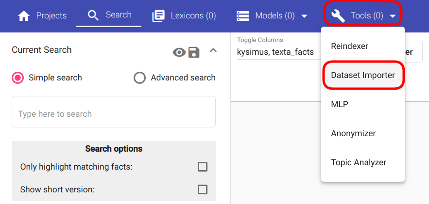

##################
Regex Tagger Group
##################

:ref:`Regex Tagger Group <regex_tagger_group_concept>` is a Tagger for Regexer, read more under the terminology. "Üleliigsed seletused välja, kuna need tulevad terminoloogia alla".

Iga tagger all on: Creation, Useage, Application, Fine-tuning

Creation, tase 2
******************

GUI, tase 3
==============

Esimese alapealkirja alapealkiri, tase 4
-----------------------------------------

No kui veel on vaja alapealkirjatada, siis see on tase 5
^^^^^^^^^^^^^^^^^^^^^^^^^^^^^^^^^^^^^^^^^^^^^^^^^^^^^^^^^^

API, tase 3
==============

Siin viidatakse joonisele :numref:`importing_loc2`.

.. _importing_loc2:

	
	*See on joonis*

Useage
********

GUI
====

API
===

Application
************

GUI
====

API
===

Fine-Tuning
***********

Siia tulevad parameetrid.

GUI
====

API
===
