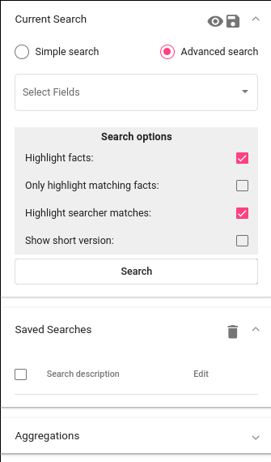
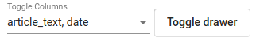

`EN <https://docs.texta.ee/v2/searcher.html>`_
`ET <https://docs.texta.ee/v2/et/searcher.html>`_

.. _searcher:

########
Search
########

The Search application allows users to perform searches and aggregations over the data. Search results can be used as input to machine learning models.

.. note::
	To use the **Search** project and indices must be selected from the upper right panel.

The Search's graphical interface (:numref:`search_panel`) consists of three panels.
These are :ref:`Current Search <currentsearch>`, :ref:`Saved Searches <savedsearches>`, and :ref:`Aggregations <aggregations>`. 
By default the panel of Current Search open. Clicking on the name of the panel collapses or opens that panel.

.. _search_panel:

	*Search panels*

.. note::
	The Searcher will only look into the datasets that are selected on the top-right panel.

.. _currentsearch:

Current Search
***************

GUI
====

Current Search is a tool for simple data browsing. It also allows us to create filters to only search for documents in our interest.
For the latter purpose, we can create a set of constraints on :ref:`field <field_concept>` values. This can be done using either Simple Search 
or Advanced Search. 

.. note::
	Current Search doesn't differentiate lower and upper case (except regex constraint). This means that searching for "President" also matches "president". If the case is important in the search, use regex constraint (see below).

Simple Search
-------------

Simple search searches for a word or words on all fields in the chosen dataset(s). 
Multiple words must be separated with space (" "). 
The search returns documents where each word occurs at least in one of the fields.

To use Simple Search, select it on the Current Search panel and type in the words you want to search for (:ref:`field <simple_search>` values).

.. _simple_search:
.. figure:: images/searcher/simple_search.png

  *Simple search*

Advanced Search
---------------

Advanced search allows us to create different constraints for different fields. 
There are three types of constraints we can use: string constraints, date constraints, and texta_facts constraints.

To use Advanced Search, select it on the Current Search panel. After that select fields on which you want to use your constraint. 
Click anywhere in the toolkit to close the fields' selection. You should see a box where you can create your constraint (:ref:`field <string_search>`).
You can remove the constraint by clicking on the ‘X’-sign on the upper right corner of the box.

.. _string_search:
.. figure:: images/searcher/string_search.png

  *Advanced search*

String constraint
^^^^^^^^^^^^^^^^^

Different search strings must be written to different lines. 
The search strings must be tied with one of the **Operator** from the table below:

.. list-table:: Operators
   :widths: 10 25
   :header-rows: 1

   * - Operator
     - Meaning
   * - and
     - all of the search strings (lines) are matched in the document 
   * - or
     - at least one of the search string (lines) is matched in the document
   * - not
     - the document must not match any of the given search string

You must also choose a **Match** rule. These are given in the table below:

.. list-table:: Match
   :widths: 10 25
   :header-rows: 1
   
   * - Match rule
     - Meaning
   * - phrase prefix
     - matches the beginning of the words (endings can differ, e.g. searching for 'bribe' gives us 'bribe', 'bribery', 'bribetaking', etc)
   * - word
     - finds exact word written (similar to simple search)
   * - phrase 
     - finds exact match for a phrase (more than one word in one line)
   * - regex
     - takes the input as `a regular expression <https://www.rexegg.com/regex-quickstart.html>`_ and searches document accordingly. Nb! This is :ref:`Elasticsearch <elasticsearch>` syntax.

Finally, there is a value called **Slop**. If any of your search strings contains multiple words, then
this defines how many words can be between that search string words.
     
In figure :ref:`field <string_search>`, the string constraint is on the field named "text". 
The search will return documents that have either phrase "president Obama" or "president Trump" in it (or both). 
Since the Slop is 2, it also matches the phrase if it has 0-2 words between the words (e.g "president Barack Obama").

.. note::
	You can use an existing :ref:`lexicon <lexiconminer>` to create constraints. This can be done via button **Add lexicon** (visible only if there exist any lexicons in the project."
	
Date constraint
^^^^^^^^^^^^^^^

Date constraint is for fields with type date. This outputs only documents where the field value is within the chosen time range (starting day included and ending day excluded). 
You can choose the time range by clicking on the little calendar on the right.

.. _date_constraint:
.. figure:: images/date_constraint.png

	*Date constraint*

Texta_facts constraint
^^^^^^^^^^^^^^^^^^^^^^^

Texta_facts constraint allows us to find documents with certain :ref:`fact <texta_fact>` names or fact values. 

**Creating a constraint over fact names**

.. _tag_constraint3:
.. figure:: images/tag_constraint3.png

	*Fact name constraint with or*. Outputs all documents that contain at least one of the given fact name.

**Using different constraints for different fact names**

In order to use different constraints for different fact names, you need to select field **texta_facts[fact_name]** multiple times.

.. _tag_constraint1:

	*Fact name constraint*. Outputs documents that contain an ORG fact and definitely not PER fact. 

**Creating a constraint over fact values**
	
.. _tag_constraint2:

	*Fact value constraint*. Outputs documents that have an ORG fact with either value "NATO" or value "European Union" in it (or both).
	

Search Options
^^^^^^^^^^^^^^

Look at the table below for the meanings of search options. 

.. list-table:: Search options
   :widths: 25 25
   :header-rows: 1

   * - Option
     - Meaning
   * - Highlight facts
     - highlights all the facts in the text
   * - Only highlight matching facts
     - highlights only the facts that were looked for
   * - Highlight searcher matches
     - highlights string constraints' matches
   * - Show short version
     - shows certain amount of words before and after the match

.. _search_options:
.. figure:: images/search_options.png

	*Search Options*
	
Advanced Search examples
^^^^^^^^^^^^^^^^^^^^^^^^

.. _search_example1:
.. figure:: images/search_example1.png

	*Regex String Constraint*. Search for documents that have either "payoff" or "bribe[a-z]{0,2}" in it.The latter condition means that word ‘bribe’ can have 0-2 extra letters (e.g “bribe”, “bribed”, “bribery”) in the end.
	
.. _search_combination:

	*Combination of constraints*. Search for documents published in 2014, contain LOC facts with values "Russia" and "Ukraine" and the word "invasion".

Browsing Search results
^^^^^^^^^^^^^^^^^^^^^^^

After clicking the “Search” button, the matching documents are shown. (see :numref:`search_results`). 

.. _search_results:
.. figure:: images/search_results.png
	:width: 100 %

	*Example search results*

You can choose the columns that we would like to see from the drop-down menu right above the results.
You can select or deselect all of them together (*Select all*) or by clicking on them separately. 

It is possible to hide the constraint panels with the *Toggle drawer* button. 

Use arrows in the upper right to navigate between pages. You can also choose how many items per page you would like to see (also in the upper right corner).

.. _search_rt:

	*Select Fields for Search Results*

API
===

API for scrolling can be found `here <https://rest-dev.texta.ee/api/v1/projects/1/scroll/>`_.

.. _savedsearches:

Saved Searches
***************

GUI
===

To save a search, click on the **disk** icon in the upper right corner of the Current Search panel. Saved searches can be used in other applications available in Texta Toolkit.
For example, you can use a search as a set of positive samples when training a tagger or as a set of documents to be analyzed with Topic Analyzer.
Or you might just want to save a search for browsing it later: to open it in the Current Search, simply click on the name of it.

If you are curious, you can see the actual :ref:`Elasticsearch <elasticsearch>` query behind the search by clicking on the **eye** icon next to the disk icon.

API
===

API support for saving searches can be found `here <https://rest-dev.texta.ee/api/v1/projects/1/searches/>`_.

.. _aggregations:

Aggregations
*************

GUI
===

Aggregations tool allows us to aggregate the data. 
For example, we can use it to perform simple aggregations - retrieve item and word distributions.

For instance, let's assume we have a dataset containing posts from Estonian Reddit. We can use an aggregation over field *post_title* to find the most popular threads (see :numref:`significant_items`).

.. _significant_items:

	*Significant items*

Now, knowing that the most popular thread is *Coronavirus megathread*, we might want to know what are the words that characterize the dataset when compared to other threads. 
In Texta Toolkit such words are called **significant words** and can be found with aggregations tool (see :numref:`significant_words`).

.. _significant_words:

	*Significant words*

.. note::
    **How are the significance scores calculated?**
	In brief, a term is considered significant if there is a noticeable difference in the frequency in which a term appears in the subset and in the background.

Besides these simple words and items aggregations shown above, there is still so much more that you can do with the tool.

For example, you can examine the distribution of the data over time (see :numref:`simple_time_aggregation`). Note that to produce such graphs, you must have a proper date field (in Texta date format) in the data.

.. _simple_time_aggregation:

	*Time aggregation*

If you have texta_facts added to your data, you can visualize the frequencies of the values of one or more facts (see :numref:`facts_aggre`).
Note that on top of the plot in figure :numref:`facts_aggre`, there is a list with three visualization options. You can click on them to change how the results are displayed - 
whether hierarchically, as a table, or as a plot.

.. _facts_aggre:

	  *Facts aggregation*

By creating a set of saved searches, we can visualize the time distribution of multiple subsets at once. For example, if we have a news articles datasets, we might 
want to know how often different politicians were mentioned in the news in different time periods (see :numref:`saved_searches_aggre`).

.. _saved_searches_aggre:

	  *Saved searches aggregation*
