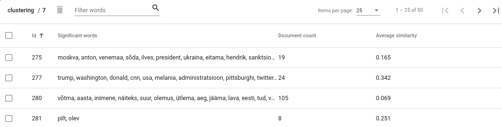
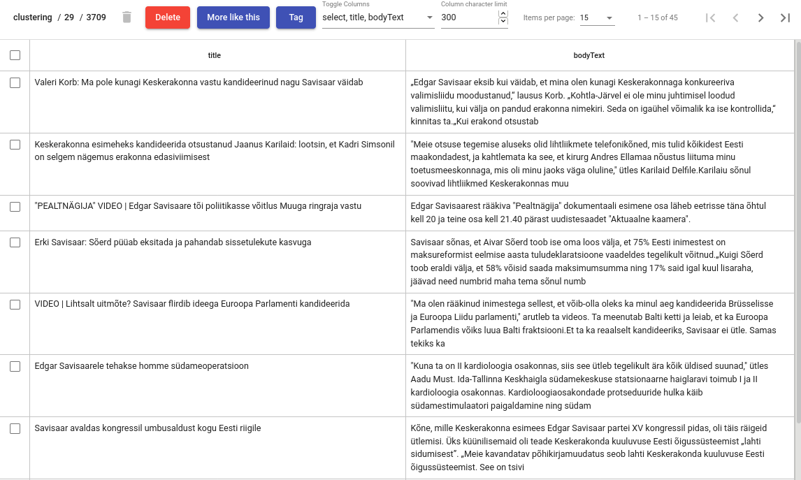

`EN <https://docs.texta.ee/topic_analyzer.html>`_
`ET <https://docs.texta.ee/et/topic_analyzer.html>`_

.. _topic_analyzer:

##############
Topic Analyzer
##############

.. note::

	There exists an API for topic analyzer too, but the magic of the analyzer dissappears when using API.

.. _create_TA:

Create
*******

GUI
=====

Navigate to **Tools -> Topic Analyzer** and click on the **CREATE** button on top-left. Choose the name for your :ref:`Analyzer <topic_analyzer_concept>` (*Description*).
Define the :ref:`query <query_concept>` and select indices on which the :ref:`query <query_concept>` will be executed. If you leave *Query* empty, it will take all documents from the selected indices.
If you have any searches defined in your :ref:`project <project_concept>`, they will appear in a dropdown menu if you click on the field *Query* - you can use existing searches as queries.

Choose *fields* on which the clustering is done. The selected fields should contain textual data.

.. note::
	It is recommended to use lemmatized or tokenized data. Lemmatization is especially useful with morphologically complex languages. You can tokenize and lemmatize the data with :ref:`MLP <mlp>`.

*Embedding* - if selected then its phraser is used for tokenization. You can leave it empty as well.

*Keywords filter* - defines a filter (as a regular expression) for unwanted significant words.

*Stopwords* - custom stopwords to ignore during clustering.

*Clustering algorithm* - an algorithm to use for clustering. Minibatchkmeans is a time efficient variant of kmeans with a potential tradeff in quality.
*Vectorizer* - a method for creating document vectors.

*Document limit* - number of documents that will be clustered. Possible maximum is 10000.

*Num cluster* - number of final clusters.

*Num dims* - maximum possible dimension of document vectors.

*Num topics* - number of dimensions when *Use LSI* is selected.

*Use LSI* - if selected then high dimensional document-term vectors are reduced into lower dimensional vectors that base on "topics".

.. note::

	**How to choose the number of clusters?**
	
	General advice would is to better have too many clusters than too few. Think about how many documents you are planning to cluster and choose the number so that the average cluster is small enough to inspect it manually with ease. For example, if you are going to cluster 1000 documents to 50 clusters then average cluster would contain 20 documents. 

.. _figure-17:

.. figure:: images/create_clustering.png

    *Creating a Clustering*

Viewing clusters
********************

GUI
=====

Click *View clusters* under Actions. You will see an overwiew about obtained clusters. For each cluster the document count and average cosine similarity between its documents is given as well as a list of significant words.

.. _figure-18:

    *Clusters view*

.. note::

	**Interpreting document count**
	
	Cluster with significantly larger document count often indicates that the clustering algorithm has failed to separate these documents by the topic. It doesn't necessarily mean that the clustering process in general has been unsuccessful as often it is impossible to cluster all documents perfectly. However, you still might want to take a closer look to such clusters as there may be other reasons for such results as well. For example, the documents in that cluster may contain similar noise or stopwords that makes them artifically similar to each other. Sometimes increasing the number of clusters might help as well.

	**Interpreting average similarity**
	
	Average similarity is an average cosine similarity between all the documents in the cluster. It ranges between 0 and 1 and higher score indicates that the documents in that cluster are more similar to each other. However, the score has some disadvantages. For example, when a cluster contains 9 documents that are very similar to each other and 10th document is very different from all others, then the score might appear low althought fixing that cluster would be very easy.

Viewing documents inside cluster
*********************************

GUI
=====

Click on a cluster that is in your interest, this opens you a detailed view of a cluster content.

Operations with the cluster
****************************

GUI
=====

Tag documents
--------------

If the cluster contains documents from the same topic it is advisable to tag the documets and delete the cluster. Click on **Tag** button.
This operation adds a texta_fact to each of the document in the cluster, with specified name and a string value. **From now on, these documents will be ignored in further clustering processes**

Delete documents
-----------------

This functionality is useful if some documents in the cluster are from a different topic and you want to remove them - select the documents that you want to remove and click on **trash bin** icon.

Add more documents
--------------------

You might want to know whether there exists more documents similar to the ones in the cluster, and if so, add those to the cluster as well, so you could tag them all together.
Click on a "More like this" button to query similar documents. In the opened view, select document which you would like to add to the cluster and click on a **+** button.

Delete the cluster
------------------

It is advisable to delete the cluster after you have tagged it. Click on **Delete** button to do it.

.. _figure-19:

    *Cluster details view*

