`EN <https://docs.texta.ee/use_cases.html>`_
`ET <https://docs.texta.ee/et/use_cases.html>`_

################
Use Cases
################

This chapter describes how to use Texta Toolkit's different tools to answer some research questions.

How to search for a topic if you don't know enough topic words?
***************************************************************
Research question: *What is the frequency of sport-related documents through time?"*

Pre-requirements:

* A :ref:`project <project_concept>` with the sputnik newspaper articles dataset is :ref:`created <project>`.
* This project is active (chosen on the upper panel in the right).

Train an embedding
====================

Go to Models > Embeddings. Click on "CREATE" in the top-left. Create an :ref:`Embedding <embedding_concept>` (:numref:`embedding_pic`). Read more about the creating parameters :ref:`here <create_embedding>`.

.. _embedding_pic:
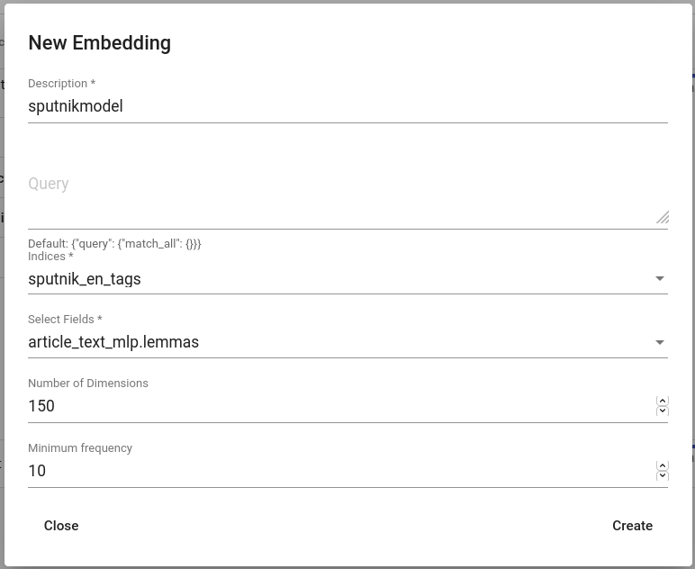
	
	*Creating an embedding for sputnik*
	
This step might take a while. After the :ref:`embedding <embedding_concept>` model is trained, the Lexicon Miner can be used.

Use Lexicon Miner
==================

Use the :ref:`Lexicon Miner <lexiconminer>` for mining other words than just "sport".

.. _miner:
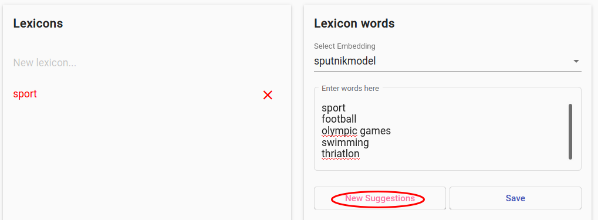
	
	*Providing some seed words for before hitting "New Suggestions"*
	
Provide some seedwords (example in :numref:`miner`), hit "New Suggestions", click on suitable terms and repeat as long as the suggestions contain suitable terms. Then hit "Save".

Search
=======

Go to the Search page. As this example :ref:`embedding <embedding_concept>` was trained on lemmas :ref:`field <field_concept>`, choose the same field in the Advanced Search. Click on "Add lexicon" button and choose the saved lexicon.

.. _add_lexicon:
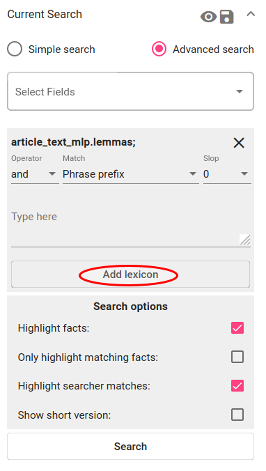

	*Add lexicon for the search constraint*
	
Choose the operator "or". Match stays default ("Phrase prefix") and Slop also ("0"). Click on Search. 

You now have more results than just searching the term "sport"!

Bonus: aggregate over time
===========================

Research question: *When are sport-related articles published?*

In order to aggregate the documents over time, open the Aggregations panel and choose the date :ref:`field <field_concept>` (in Texta date format). Configure other options as shown in :numref:`aggregate_sport` or leave them as default. Click on "Aggregate".

.. _aggregate_sport:
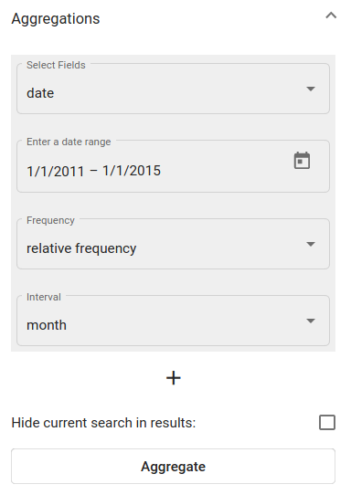
	
	*Active sport-topic search results' aggregation over date field*
	
The aggregation outputs a line chart with the results. The X-axis is the raw frequency, Y-axis is the date. 

.. _linechart_sport:
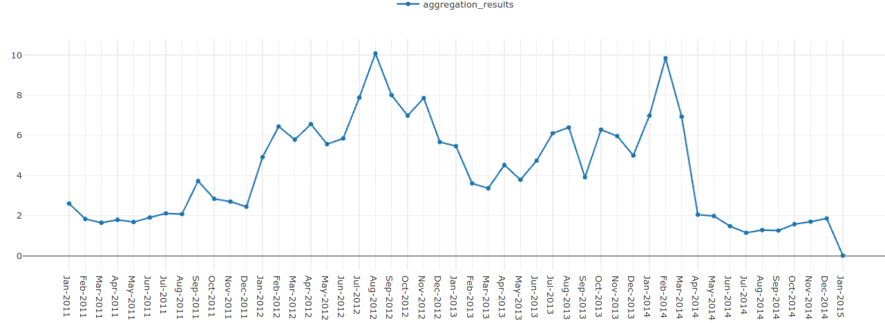
	
	*Line chart of sport-related articles from 1th of January 2011 to 1th of January 2015*

You can see that most sport-related articles are published in August 2012 and February 2014. These, surprise-surprise, overlap with the times of Summer Olympics (27th of July to 12th of August 2012) and Winter Olympics (7th of February to 23rd of February 2014).

When is this term most frequently used?
****************************************

Research question: *How frequent are the terms "communism" and "communists" in Sputnik through time?*

Pre-requirements:

* A :ref:`project <project_concept>` with the sputnik newspaper articles dataset is :ref:`created <project>`.
* This project is active (chosen on the upper panel in the right).
* :ref:`Searcher <searcher>` is open.

Search term(s)
==============

Click on "Advanced search" and choose the :ref:`field <field_concept>` with the content in it ("article_text"). :numref:`search_communism` describes the search constraint for finding documents with words that start with "communis" (e.g "communism", "communist", "communists") - operator is "and" or "or", match is "Phrase prefix" and there is no slop. Click on "Search".

.. _search_communism:
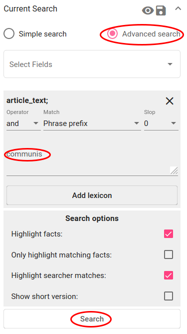

	*Search constraint for finding communism-related articles*

Now the table displays all the documents that the searcher with this constraint filtered out. This search result is now *active*. If you want, you can save it for later, but as the Aggregation works on active searches, leave it as it is.

Aggregate over time
====================

To aggregate the documents over time, open the Aggregations panel and choose the date :ref:`field <field_concept>` (in Texta date format). Other options can be left as they are. Click on "Aggregate".

.. _aggregate_communism:
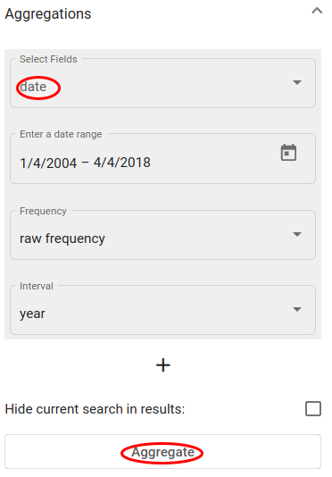
	
	*Active search results' aggregation over date field*
	
The aggregation outputs a line chart with the results. The X-axis is the raw frequency, Y-axis is the date (you can change the unit on the Aggregation panel under Interval).   

See more aggregating examples under :ref:`Search <aggregations>`.

Does my new document belong to this subset?
*******************************************

Goal: *To train a classifier that detects whether a certain document belongs to the chosen subset of documents or not*

Pre-requirements:

* A :ref:`project <project_concept>` with the sputnik newspaper articles dataset is :ref:`created <project>`.
* This project is active (chosen on the upper panel in the right).

Create a subset of positive documents
=======================================

When the user already has the dataset tagged in some way (dataset contains a certain Tag field with the tag, for example), they can use the Searcher to filter the tagged documents out as the positive examples and save it.

When the dataset does not already contain the tagged documents, the user can train an :ref:`embedding <embedding_concept>` and use the Lexicon Miner and/or the Searcher for creating some theme-related subset. There is an example of that in the first use case above.

This use case follows the first scenario and saves a subset of documents with "Middle East" in its rubric field (see :numref:`search_middleeast`). These will be positive examples similar to which the trained tagger later on tags also as positive. The user saves the search via floppy disk icon near the Current Search panel.

.. _search_middleeast:
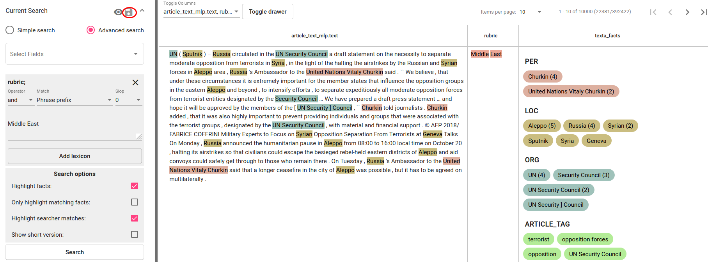

	*Search constraint for finding articles with "Middle East" in the rubric field*

Train the classifier
=====================

Under Models > :ref:`Taggers <tagger>` a classifier (tagger) can be trained. User clicks on the "CREATE" button in the top left and chooses suitable parameters in the pop-up window. The saved search is chosen as the :ref:`query <query_concept>`. Fields "article_text_mlp.text" and "title" will be just concatenated together. User can test different vectorizers and classifiers and their parameters by training different classifiers with the same positive dataset or leave them default. 

.. _tagger_middleeast:
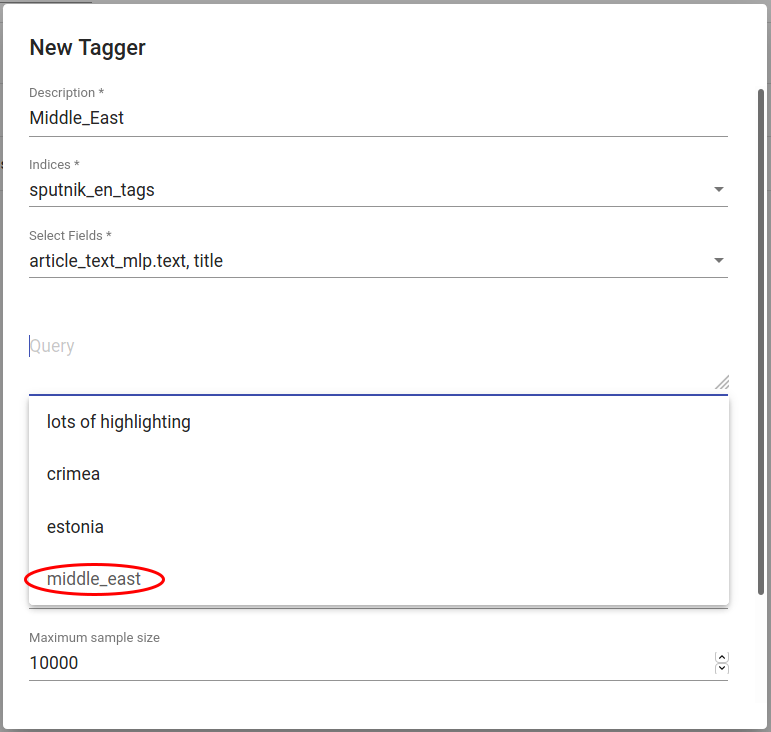

	*Creating a classifier for tagging Middle East-related articles*
	
After hitting the "Create"-button (scroll down a bit if necessary) all left to do is to wait a bit until the classifier finishes training.

Test the classifier
====================

The easiest way to quickly test the new classifier is to use "tag random doc" under the three dots under Actions. This takes a random document from the dataset and outputs the tagger's result and probability of that result being correct. 

.. _tag_random:
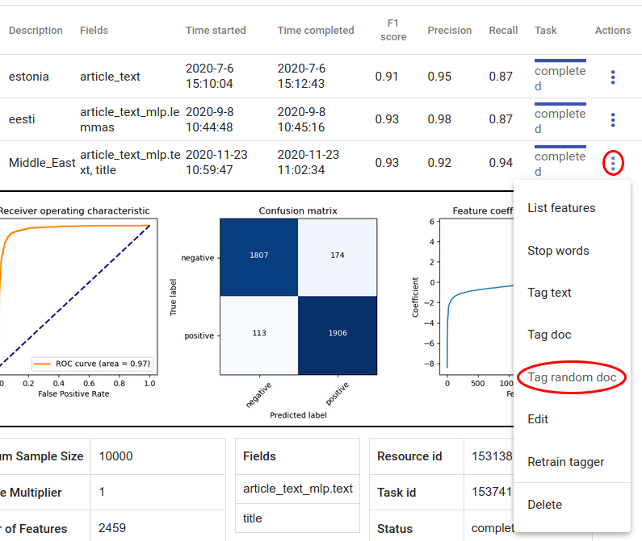

	*Tag random doc*
	
.. _correct_false:
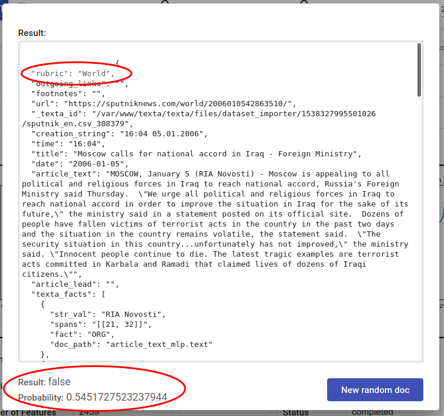

	*Random doc is not Middle East themed and tagger outputs correctly False*

.. _correct_true:
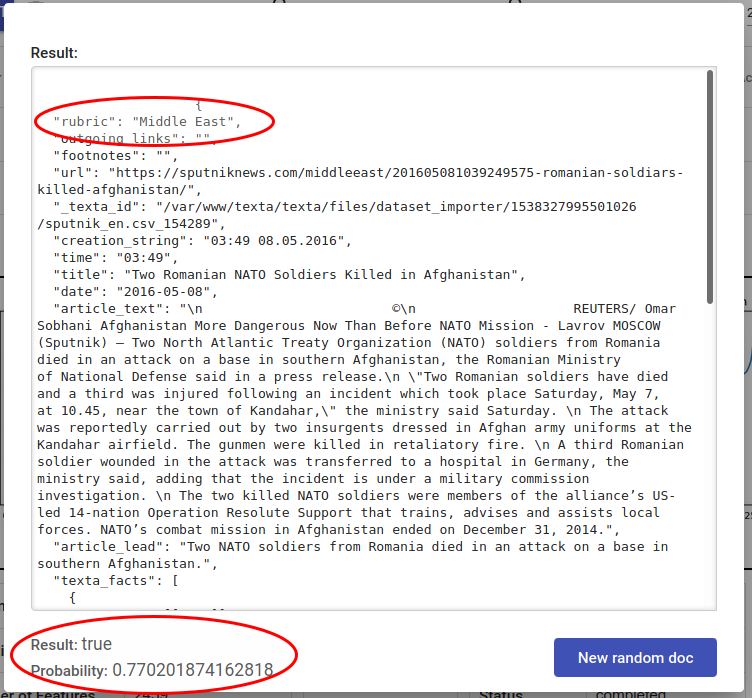

	*Random doc is Middle East themed and tagger outputs correctly True*	
	
User can also paste their text into "tag text" box for classification or use the new tagger via API. Read more about these options :ref:`here <tagger_usage>`.
