Using TEXTA Toolkit
===================

First steps
-----------

The login screen
++++++++++++++++

After starting up TEXTA, as described in the :ref:`installation step <running-texta>`, the next intuitive thing is to start using it.
Since it is a web application, we have to navigate to the corresponding address in our browser
(e.g. `http://localhost:8000/ <http://localhost:8000/>`_ if running locally or `https://live.texta.ee/ <https://live.texta.ee/>`_ if running on Texta's server). We are welcomed by a login page as depicted in Figure 1.

.. _figure-1:

.. figure:: images/01_welcome.png

    Figure 1. *Welcome screen*
    
    1. Login area
    2. Registration

Login page allows to login, as well as to register. 

.. note::

    When starting up the TEXTA instance for the first time, it is crucial to create the superuser account (:ref:`installation's final touches <final-touches>`).
	The supersuser account is used to set up TEXTA and it's features to all other users.

After the login
++++++++++++++++

Once we have logged in with our superuser, we reach the home page, which looks much like the page before,
with the exception of a list of tools and some global settings in the upper panel. On the home page you can change your password.

.. _figure-2:

.. figure:: images/02_after_login.png

    Figure 2. *Home page*
    
As we can see from the global settings panel, we don't have any datasets nor language models.
Therefore, we need to do some setting up in "Administration".

.. note::

    Restricted contains the superuser tools for managing users, datasets, language models and text classifiers.

Importing data
--------------

To start analyzing data, we need some in the first place.  As the toolkit relies on Elasticsearch database, we could
insert data manually, while conforming to the rules and schema described
:ref:`here <elastic-schema>`.

However, as this might take a lot of work, the toolkit comes with a graphical data importing tool called "Dataset Importer",
which can be found under "Restricted" menu on the top.

Dataset Importer
++++++++++++++++

Dataset Importer ("importer" from now on) is a tool which allows to insert data in many formats, preprocess it, and
finally store it in the underlying Elasticsearch database, so that it could be then used for analyzing using the other
tools the importer provides.

.. figure:: images/dataset_importer/01_overview.png

    Figure: Dataset Importer

We insert data with import jobs - requests for the server to process and store the provided documents.

Creating a new import job
*************************

Selecting formats
^^^^^^^^^^^^^^^^^

To create a new import job, we must first list all the formats that we have and from which we want to import. For that
we select all the applicable formats from the "Select all applicable formats" drop-down menu. For example, let's suppose
we want to import data from PDF and TXT and that they are in a ZIP archive.

    Figure: Selecting formats which we want to import to TEXTA Toolkit from our data source

.. note:: **Simple documents** store the content of the file to the field named "text". Simple document *a.txt* can also be accompanied
          in an archive by *a.meta.json* JSON file, which has other features, such as author, timestamp, or topic. All the
          JSON file's keys and values end up in the final dataset as columns and values.

Specifying input data parameters
^^^^^^^^^^^^^^^^^^^^^^^^^^^^^^^^

After we have selected the formats, the necessary fields which need filling will be displayed under "Input Data" section.
We need to fill in additional information because importer has to know which data and from where to fetch. Also, some
formats need further instructions - e.g a password for a ZIP archive or an XPath query for an XML document.

For TXT, PDF, and ZIP files we currently only have to specify the source from where should the importer retrieve the data.
For regular files, the importer supports uploading a single file (could be an archive as well), downloading the file
from an URL, or loading from the server's local file system.

.. figure:: images/dataset_importer/03_specifying_input_data.png

    Figure: Specifying data source

Specifying storage options
^^^^^^^^^^^^^^^^^^^^^^^^^^

Once the importer knows where to get the data from - and in some instances, how - we now need to specify to where and how
to store the imported data. For that we need to fill in the fields under "TEXTA Dataset" section.
We must name the dataset (will be used as both Elasticsearch index and mapping name).

In addition, we can optionally
  * specify a list of fields to be left untouched by Elasticsearch'es processors;
  * ask to keep the database synchronized with the data source, if possible, and
  * ask to overwrite an existing dataset, if the names collide.

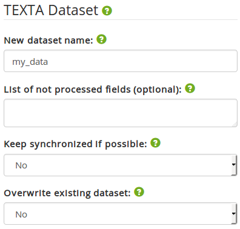

    Figure: Specifying storage options

Specifying preprocessors
^^^^^^^^^^^^^^^^^^^^^^^^

Finally, we can optionally specify the preprocessors we want to apply. Each preprocessor enhances the final dataset (data table) with
additional features (columns). To apply a preprocessor to the import job, select the desired preprocessor and fill in
the fields it requires. 

.. figure:: images/dataset_importer/05_specifying_preprocessors.png

    Figure: Specifying preprocessors

Date conversion preprocessor converts date field values to correct Texta date format. Texta predicts the current format of the date based on the language. If we have a date field, we add the field to get data from and choose the language in which the data format is written. 

Text Tagger preprocessor tags documents with Texta Text Taggers previously trained on other documents. If we already have a :ref:`tagger trained <classificationmanager>` we can choose to tag the text with it while importing. Don't forget to add the field to get data from. 

Multilingual preprocessor identifies the language of the text and extracts the facts (for example, addresses and the names of organisations, personas and locations) with what we can later work. So far it supports Estonian, Russian and English. If we choose the preprocessor we add the field to get data from.

All those preprocessors can be applied :ref:`after importing <applyPreprocessor>` as well. 

Submitting the import job
*************************

After we have filled in all the necessary fields, we are allowed to press "Import" button.

Tracking the import jobs
************************

All the import jobs that have been completed or are still in progress are displayed in the "Import Jobs" table. Here we
can see how far are the current import jobs and also which are the parameters and other details of all the started
import jobs.

.. figure:: images/dataset_importer/06_tracking_import_jobs.png

    Figure: Tracking current and past import jobs

We can also remove an import job entry by clicking on the X in the Remove column or see further details by clicking on the eye icon in the View Details column.

.. figure:: images/dataset_importer/07_import_job_details.png

    Figure: Specific import job's details

Administration: Manage Users and Datasets
-----------------------------------------

The biggest bosses in TEXTA Toolkit are the superusers, whose privileges include:
	1. Managing Users and their access rights (Access & Dataset Management in Administration under Restricted)
	2. Managing and importing datasets (Access & Dataset Management in Administration and dataset Importer under Restricted)
	3. Training language models (Train Language Model in Task Manager under Restricted)
	4. Training and applying text classifiers (Train Text Tagger in Task Manager under Restricted)
	5. Apply preprocessors (Apply preprocessor in Task Manager under Restricted)

Naturally, there can be more than one superuser.
New superusers can be created by either by promoting existing user to superusers in Administration or by using the command described in 
:ref:`installation's final touches <final-touches>`.

Managing users and their access rights
++++++++++++++++++++++++++++++++++++++

Users and their access to datasets can be configured in the "User Access Management" panel in "Administration":

.. figure:: images/03_user.png

    Figure 3. *Panel in Administration for managing users*

Each new user will be created either as activated or deactivated, in which case a superuser has to manually activate each user by clicking "activate". Users can be given superuser status by clicking on the arrow next to 'false' in the Superuser column. 
By default, new users will be created as deactivated, but this can be changed in settings.py by:

.. code-block:: python

	USER_ISACTIVE_DEFAULT = True
	
User's access to existing datasets can be managed by clicking on the username, which opens a modal:

.. figure:: images/04_user_datasets.png

    Figure 4. *The datasets can be moved between the two fields to determine user's access to it*

Managing datasets
+++++++++++++++++

Superusers can add datasets by selecting the according index and mapping in the "Dataset Management" panel:

.. figure:: images/05_datasets.png

    Figure 4. *Adding a new dataset*

Each new dataset can either be public or private. Public datasets are accessible for all users by default, but exceptions can be made in "User Management" panel.
In contrast to public datasets, private datasets are closed to everyone (except the supersusers) by default. Again, individual access can be granted in "User Management" panel.

Datasets can be closed and opened. Closed datasets are not listed to the users. Datasets can also be removed from TEXTA.

.. note::
	Removing dataset in TEXTA does not delete the actual dataset on the disk, but rather deletes the link between Elasticsearch index and TEXTA.

Training language models
++++++++++++++++++++++++

In order to successfully extract terminology from a dataset, one needs a language model. Language models can be trained
with "Train Language Model" application under "Task Manager" under "Restricted" (available for superusers only).

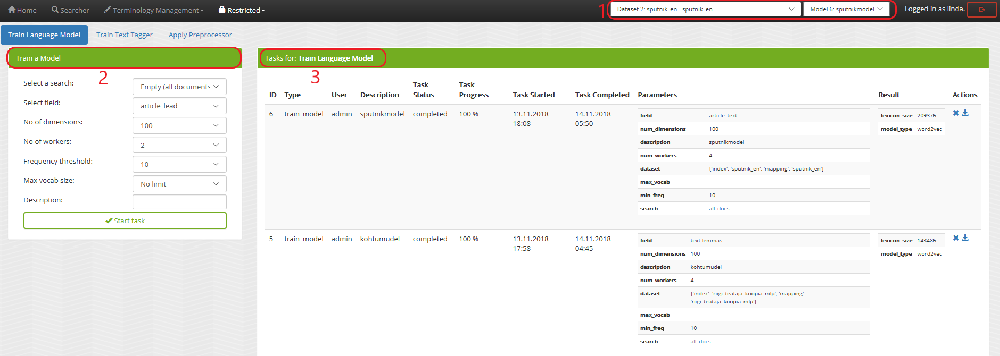

    Figure 5. *Model Manager*

    1. The training data
	2. New model parameters
    3. Trained models
	
To train a model, we need to specify the training data. The model uses the data we have chosen from the upper panel. 
By default, all exsisting documents in the given dataset are used ('Select a search: Empty (all documents)'). We can also train a model on the data we have filtered out with the :ref:`Searcher <running-texta>`.

    Figure 5.1. *Model parameters*
    
The training process also requires a field in the given dataset to be used as input for the language model. This is on what the model starts to train.

!!!!!No of dimensions is basically the number of attributes or the size of a word vector. The higher the number, the slower the training. Higher number is recommended with a bigger set of data. If we don't know which number to choose, we can use the default value.

No of workers is the amount of nodes in which the training takes place. 

Frequency threshold determinates the lowest frequency of a phrase occurrence that is significant. If we don't know, which one to choose, we can use the default value.

Max vocab size defines the size of the model vocabulary. If the there's no limit, then the vocabulary is a set of the all the words in the data (like ['several', 'difficulties']. If there's a limit, then the vocabulary consists of subwords segmented from the data based on the frequencies of the segments (like ['s', 'eve', 'ral', 'diffi', 'cult', 'ies']). !!!!->We don't have to deal with the subwords afterwards, this is just something for the training.

Description will be the model's name. It is advisable to choose it carefully and make it informative, so we would remember what we did later as well.

Let's train a new language model on our whole data. For that we use the default empty search. 

After starting the model training task, we can see the progress. For progress upgrade, we have to refresh the page.
    

    Figure 5.2. *Model training progress*
    
Once the training completes, we can see the following.

.. figure:: images/05-3_model_training_completed.png

    Figure 5.3. *Training completed*

	
Select datasets and language models
-----------------------------------------

The users can select dataset and language model they are working with on the upper Administration panel.
In order to switch the data or the model you are working with, just choose the preferred item from the drop-down menu on the upper panel. If the change was successfull, we'll get a confirmation. 

.. figure:: images/02_updated.png

    Figure 5.2. *Confirmation of updating the resources*
	
.. _searcher:

Searcher: Explore the Data
--------------------------

The Searcher application is responsible for both creating the searches for other Toolkit's other applications and browsing-summarizing the data.

.. note::
	In order to use Searcher, dataset must be defined in Administration application.

Searcher's graphical interface consists of serveral important panels, which are depicted in figure 6.

    Figure 6. *Searcher's first look*
    
    1. Current Search
    2. Saved Searches
    3. Aggregations
    4. Results

Creating a new search
+++++++++++++++++++++

Data browsing and summarization depend on searches. Search consists of a set of constraints on feature values. We can define our constraints on
the data using the "Current Search" panel. Without saving the constraints, we are in a "test mode", which means that we can use the search in
Searcher, but we cannot use the search in other tools. After saving the search, it is available also to other tools.

In order to add a constraint, we must first choose a field. After the field is selected, we can then specify which textual tokens should or
must occur in the interested document subset.

Suppose we are interested in finding all the documents which contains "bribery" in Estonian. It makes sense to abuse lemmas
whenever possible to account for inflection.

    Figure 6.1. *"Bribe" search constraints*

Figure 6.1 shows how we have defined that we want to find all the documents which contain either "pistis" *or* "altkäemaks"
("bribery" in Estonian). "Match" and "Match phrase" mean that we want to find exact matches, whereas "Match phrase prefix" matches prefixes
(meaning suffixes may differ).

Should we be interested in more detailed searches, we can add more constraints like the previous one.

After we have come up with a suitable search, we can save it for later uses.
 
 
Browsing data
+++++++++++++

If we click on "Search" button, we will see the matching data in a tabular form, where layered features share feature name's prefix, and
matches are highlighted.

.. figure:: images/06-2_bribe_results.png

    Figure 6.2. *Bribe search results*

We can see some basic statistics and if there are too many features, we can hide them by clicking on their green names.

Exporting data
++++++++++++++

Sometimes we want to work with a subset of data in some other application or external calculation. For example, we might want to train a 
classifier on enriched sample. To get the enriched sample (in which some classes or tokens are over-represented), we can apply the search
constraints to retrieve the data and then use query result actions, such as *export*.

    Figure 6.3. *Export panel*

Export panel allows to specify, how many rows and which features are we interested in. Exported data is in CSV format.
    
    
Deleting data
+++++++++++++

The second action on search results is deletion - if we detect some malformed data or are simply not interested in some subset, we can remove it
permanently from the Elasticsearch.
    
Using saved searches
++++++++++++++++++++

Searches can be saved. If we save our "bribery" search under "bribery", we can see it being listed in "Saved Searches" panel.

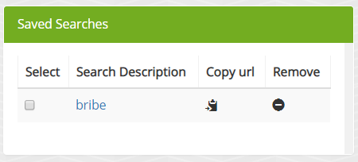

    Figure 6.4. *Saved searches*

Now, whenever we check it, we can use it to browse data or apply in summarization.
    
Summarizing data
++++++++++++++++

As fun as browsing through the data is, it is not always enough. Sometimes we want to get an overview of our data, such as topics over time or
word distributions. Searcher allows to do all of that and more through the "Aggregations" panel.

Aggregations have two components - data and features it aggregates over. Selecting a search determines the sample we get our data from. By defining a feature, we can group by that feature and get
category counts. For example, lets assume we are interested in seeing how are the top words distributed in our sample data defined by our
"bribery" search. By requesting aggregation as shown on figure 6.5, we get the result on the same figure.

.. figure:: images/06-5_simple_aggregation.png

    Figure 6.5. *Simple aggregation*

From the results we can see raw word distributions for both checked "bribery" search and "Current Search" (which doesn't have any constraints,
a.k.a sample is all the data we have). Since we queried raw count, many common words overlap. We can change "Sort by" setting to significance
in order to get uncommon over-represented words for that specific sample dataset.

    Figure 6.6. *Aggregation sorted by significance*

In figure 6.6 we can see that now the words are much more specific to the "bribery" dataset. "Current Search" has no results, because it is
used as prior.
    

Extracting Terminology
----------------------

In order to learn more about the dataset, it is useful to know the domain terminology.
TEXTA Toolkit's terminology extraction tools support the user through the process of creating lexicons,
grouping them into concepts and mining for multiword expressions.

.. note::
	Extracting Terminology requires a language model, which can be trained by superusers in Model Manager.

Creating lexicons
+++++++++++++++++

We can start creating topic-related lexicons. From toolbar we can find "Base Lexicon Miner" under "Terminology Management".

Let's create a lexicon that contains verbs accompanied with "bribery".

.. figure:: images/07_creating_verb_lexicon.png

    Figure 7. *Creating lexicon of bribery verbs*
    
After clicking on the newly created lexicon, we have to provide some seed words.

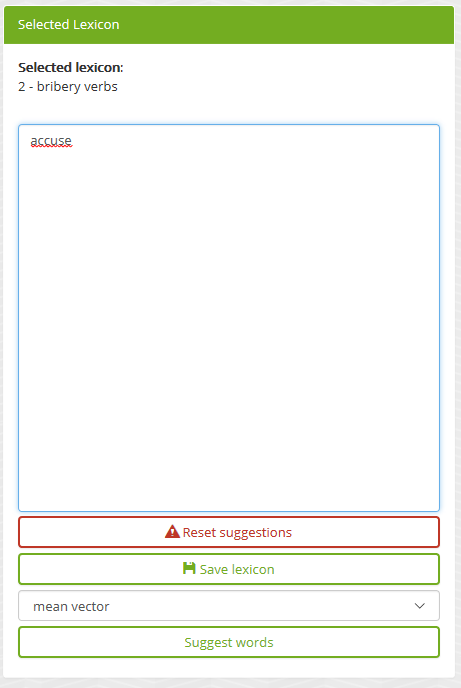

    Figure 7.1. *Providing seed words*
    
The process of creating (or expanding) the lexicon is iterative. We keep asking for suggestions and from those we have to pick the ones that
make sense to us. We keep asking for suggestions until we get no more meaningful responses. Then we should either change to some approach with
"preclustering" in it or end the process, as the training data didn't give us more.

The first batch of suggested words are shown in figure 7.2.

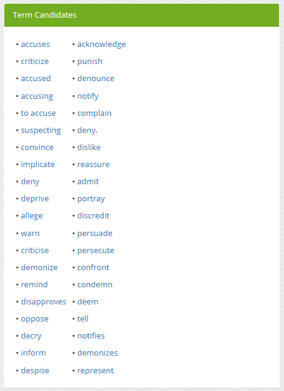

    Figure 7.2. *First suggestion batch*
    
The first suggested word - "kahtlustama" - makes sense, while the others not so much. To add it to the lexicon, we simply have to click on it. In the next batches
we also get "seostama" and "avastama". However, the yield is not as good as we hoped for. The reason behind this is that the training data is
too small. We had less than 5000 documents, most of which didn't even contain the relevant words and therefore the model had difficulties during
the training phase.

Creating concepts
+++++++++++++++++

Once we have saved the lexicons we are interested in, the next step would be to group parts of them into concepts. A lexicon may contain 
somewhat similar words which still differ from one another in some important aspects. Concepts are created with "Conceptualiser" under 
"Terminology Management". It takes lexicons as input and outputs concepts, which user defines using the graphical tool. Words are displayed on
scatter plot and user can group them using selection box or merge one by one using the *enter* key.

Word coordinates in scatter plot are derived by applying dimension reduction on high dimension word vectors. Word vectors are relying on
distributional semantics, meaning that words with similar context are similar and have in our case similar vectors - or are close to each other
in 2-dimensional space.

One of several dimension reduction methods can be chosen, but they give approximately the same results.

In our scenario, we have small and homogeneous lexicons and therefore each lexicon forms just one concept.

After checking the lexicons and plotting them, we get to the state depicted in figure 8.

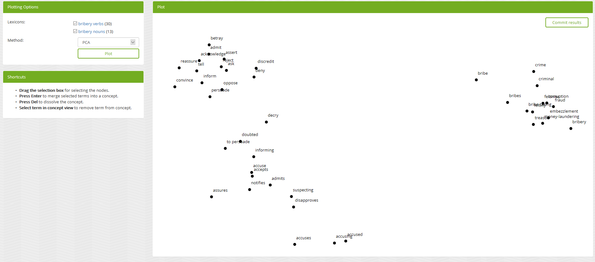

    Figure 8. *Conceptualiser's initial plot*

We can visually detect that two more or less coherent clusters have formed and "avastama" is an outlier. It was also the last word suggested by
*Lexicon Miner*. For that reason we leave that word out from our concepts.

.. figure:: images/08-1_grouped_concepts.png
    
    Figure 8.1. *After grouping the words into concepts*
    
Now that we have found the concepts, we can commit the changes to save them.

.. note::

    Concepts can be used in *Searcher* by prepending an "@"-sign. So we don't have to list words one by one. They can also be used in the same
    manner in *Grammar tool*.
    
Mining multi-word expressions
+++++++++++++++++++++++++++++

Mining multi-word expressions is a way to find actually used phrases. We approched the problem bottom-up. First we defined the individual tokens
and now we try to find which of them are located nearby or side-by-side. Ideally, phrases should be found using the words with inflection data,
but since our dataset is small, we have to make it with lemmas and low frequency threshold.

Mining task requires parameters - much like training language models. In figure 9 we can see the parameters we can use.

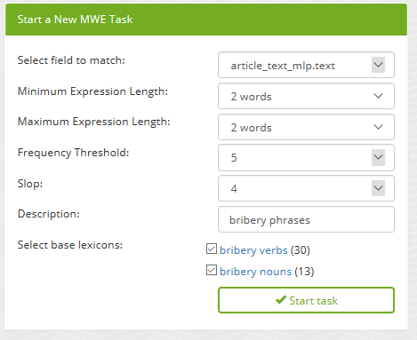

    Figure 9. *Multi-word expression mining parameters*

We have to define the feature or field, which should be the same we trained our language models on for mining lexicons. Expression lengths
determine the output phrase lengths (or combination lengths, which are searched for). Phrase occurrencies below frequency threshold are ignored
and slop determines, how far apart can the words be from one another. Finally, we have to specify the lexicons used. Since we want to find
bribery phrases which contain both noun and accusing verb, we check both lexicons.

Because the data and lexicons are small, the task completes instantly.

.. figure:: images/09-1_mwe_progress.png

    Figure 9.1. *Multi-word expression task progress*

By looking at the results, we can see that there are 9 different patterns (denoted by "Terms" feature) containing "süüdistama" and "altkäemaks"
concepts' lemmas which are frequent enough to catch our interest. 

.. figure:: images/09-2_mwe_results.png

    Figure 9.2. *Multi-word expression results*

We can expand the result by clicking on the "plus"-sign under "Accepted" feature to see which patterns actually existed and with which
frequency.
    
.. figure:: images/09-3_expanded_results.png

    Figure 9.3. *Expanded results*

The expanded results show how some patterns are much more common in real use of language.

We can approve specific patterns to turn them into a concept containing multi-word expressions and therefore use the more complicated structures
in other tools, such as in the *Searcher*.

 
Grammar Miner: Extract Information
----------------------------------

TEXTA comes with an interactive grammar building tool *Grammar Miner*. "Grammars" are rule-based formulas which allow to match specific
content using exact matching, context, and logical operators. The simplest grammar can just match a fixed word, for example "bribe", or be
a regular expression, while more complicated ones may cover whole phrase and sentence structures.

We build grammars from top to bottom using a graphical tree building tool *jstree*. Once a suitable grammar expression in the form of a tree is
created, we can test it on a data sample and see, which documents matched and how and which did not. *Grammar Miner* is under *Terminology
Management* tools.

.. figure:: images/10_grammar_miner.png

    Figure 10. *Grammar Miner's first look*
    
    1. View tab
    2. Grammar building area
    3. Grammar component details
    
Building a new grammar begins with assigning an operation to the root node.

.. figure:: images/10-1_root_node_operation.png

    Figure 10.1. *Assigning operation to aggregative node*
    
.. note::

    Whenever making changes to a node, make sure to click on "Change" button.

Node types
++++++++++

Each node has an icon, indicating which type of node it is. Nodes can be either **terminal** (regular expression, exact match) or 
**aggregative** (logical or sequential operations).
Logical operations are intersection and union, where intersection needs all of its child expressions to
match, but union just one.

Sequential operations are concatenation and gap. Concatenation requires matches to reside side by side. For example, when we have a
concatenation of "took", "the", and "bribe", the concatenation matches only documents in which there are substrings "took the bribe". The gap
on the other hand can have matches with some distance from one another, defined by *slop* parameter. If we were looking for "took" and "bribe",
gap with *slop* of at least 1, it would match the documents which have "took the bribe" in them.

.. note::

    Logical operations don't take match order into account, whereas sequential operations do.

For a better overview, nodes with different operations have different icons.
    
.. |na_icon| image:: images/icons/na.ico
    
.. |exact_icon| image:: images/icons/exact.ico
    
.. |regex_icon| image:: images/icons/regex.ico
    
.. |and_icon| image:: images/icons/and.ico
    
.. |or_icon| image:: images/icons/or.ico
    
.. |concat_icon| image:: images/icons/concat.ico

.. |gap_icon| image:: images/icons/gap.ico

=============    ==================
Icon             Operation    
=============    ==================
|na_icon|        Not assigned
|exact_icon|     Exact match
|regex_icon|     Regular expression
|and_icon|       Intersection
|or_icon|        Union
|concat_icon|    Concatenation
|gap_icon|       Gap
=============    ==================

Root node is always aggregative. Aggregative nodes can have both terminal and aggregative nodes as children. Terminal nodes can't have any
children.

Adding a child
++++++++++++++

Aggregative nodes can (must) have child nodes (at least one). A child can be added by opening context menu with right click on the appropriate
node. This allows to add either a *basic* (terminal) or *aggregation* node.

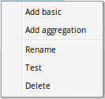

    Figure 10.2. *Context menu for adding child nodes*

After adding a terminal node and clicking on it, we can edit the details in opened "Component Details" panel.

.. figure:: images/10-3_basic_component_details.png

    Figure 10.3. *Specifying terminal node details*
    
We can choose either "Exact match" or "Regular Expression" for *Type* and one of the features or feature-layer combinations for the *Layer*.
Content is a list of words on separate lines for an *Exact match* or a one-liner regular expression for *Regular Expression*.

Testing grammar
+++++++++++++++

We can either test the whole grammar tree by clicking on the "Test whole tree" button or a subtree by clicking on "Test" in the appropriate
node's context menu.

Suppose we are interested in finding (and later labeling) the documents which talk about bribery accusations. We have already found out that 
the most frequent pattern in the corresponding documents contain the lemmas "süüdistama" and "altkäemaks" in that order with the slop of 3.
Let's create the grammar tree.

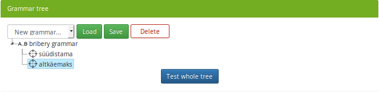

    Figure 10.4. *Simple bribery grammar*

So far we have been on the "Grammar" tab. If we test our grammar by clicking on "Test whole tree", for example, we are taken to the "Test" tab
and all the positive matches (documents which our grammar matched) are displayed along with the match highlights.
    

    Figure 10.5. *Positive results when testing*
    
When navigating to "Unmatched documents" subtab, we can see the documents which didn't match our grammar.
    
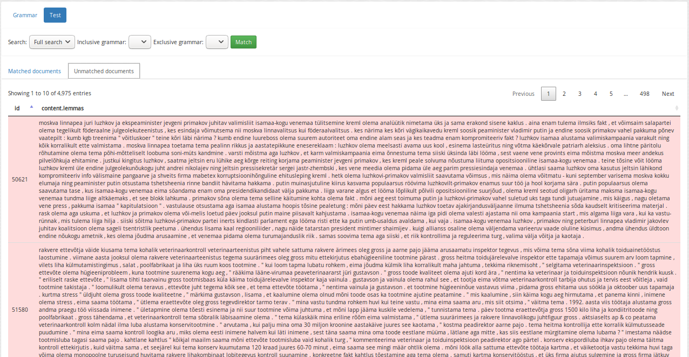

    Figure 10.6. *Negative results when testing*
    
We can see that all our highlighted words are "süüdistama" and "altkäemaks", where they are no more than 3 tokens apart - just as our grammar
required. Also, all the features which are displayed in the result table occur in the grammar, except for *id*.

By default, "Full search" is used. We can change it to our "bribery", navigate back to "Grammar" tab and test the grammar again to test our
grammar on more relevant dataset.

Saving and loading grammar
++++++++++++++++++++++++++

Grammar tree can be stored for later use by clicking "Save". Root node's label is used for the name.

Whenever we want to reuse a saved grammar, we can simply select it from drop-down menu and press "Load".

Deleting grammar
++++++++++++++++

We can delete grammar trees by selecting the appropriate grammar from the drop-down menu and clicking on "Delete".

.. _classificationmanager:

Classificaton Manager: Tag the Texts
------------------------------------

When we have a set of documents in our dataset that we know are somehow important, we can build a text classifier to automatically detect such documents in the future.
In order to complete such a task, we can use the "Classification Manager" application.

Training a classificaton model
++++++++++++++++++++++++++++++

In order to train a model, we are required to define some mandatory parameters:

	1. A search to define the set of documents used to train the model (positive documents).
	2. The field describes the field of the document used to build the classification model.
	3. The name for the class or "tag", which is later user to tag the documents.

By setting these three, we can now train a classifier. However, we can also fine-tune the classifier by changing additional parameters such as
feature extraction, dimensionality reduction and classifier model.

.. figure:: images/11-1_new_model.png

    Figure 11.1. *Choosing parameters for the classification model*

Trained models are shown in the "Classification Models" panel, where each epoch is equipped with precision and recall and some information about the classifier model.
	
.. figure:: images/11-2_trained_models.png

    Figure 11.2. *Trained models*

Tagging the dataset with the model
++++++++++++++++++++++++++++++++++

By clicking "Apply" in "Classification Models" panel, user can apply the classifier on selected documents:

.. figure:: images/11-3_apply_model.png

    Figure 11.2. *Select search to define the dataset to be tagged with the selected classifier*

After pressing "Apply the Tagger", a tagging job will start and it's results will be shown in the table when completed. 
	
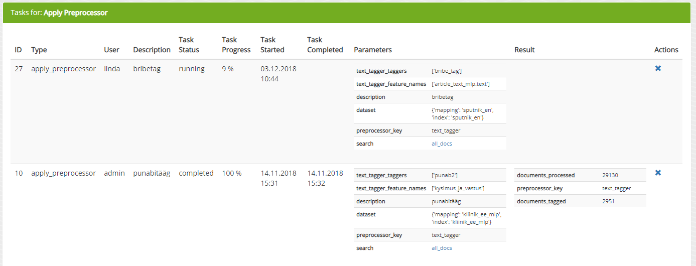

    Figure 11.2. *Applied classification models*
	
.. note::
	If the dataset contains many documents, the tagging process can be expected to take a few minutes.
	
.. _applyPreprocessor:

Apply preprocessor
------------------