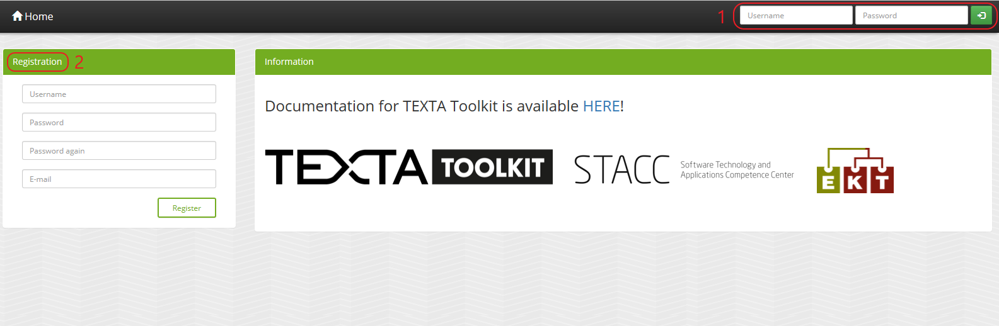
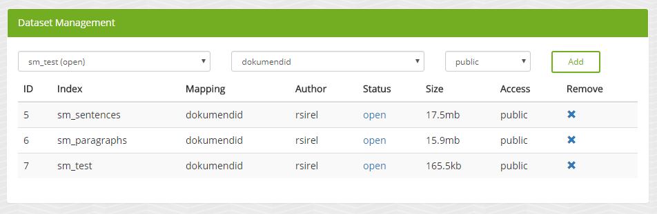
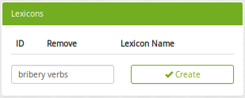
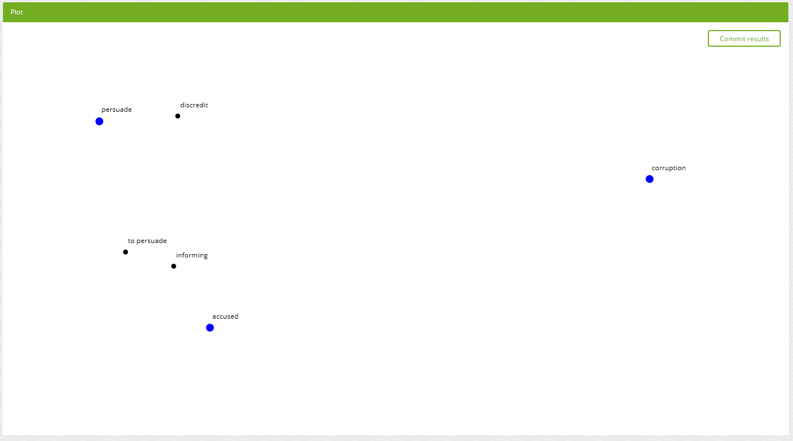

Using TEXTA Toolkit
===================

First steps
-----------

The login screen
++++++++++++++++

After starting up TEXTA, as described in the :ref:`installation step <running-texta>`, the next intuitive thing is to start using it.
Since it is a web application, we have to navigate to the corresponding address in our browser
(e.g. `http://localhost:8000/ <http://localhost:8000/>`_ if running locally or `https://live.texta.ee/ <https://live.texta.ee/>`_ if running on Texta's server). We are welcomed by a login page as depicted in Figure 1.1.

.. _figure-1:

    Figure 1.1. *Welcome screen*
    
    1. Login area
    2. Registration

Login page allows to login, as well as to register. 

.. note::

    When starting up the TEXTA instance for the first time, it is crucial to create the superuser account (:ref:`installation's final touches <final-touches>`).
	The supersuser account is used to set up TEXTA and it's features to all other users.

After the login
++++++++++++++++

Once we have logged in with our superuser, we reach the home page, which looks much like the page before,
with the exception of a list of tools and some global settings in the upper panel. On the home page you can change your password.

.. _figure-2:

.. figure:: images/02_after_login.png

    Figure 1.2. *Home page*
    
As we can see from the global settings panel, we don't have any datasets nor language models.
Therefore, we need to do some setting up in "Administration".

.. note::

    Restricted contains the superuser tools for managing users, datasets, language models and text classifiers.
	
	
	
Administration: Manage Users and Datasets
-----------------------------------------

The biggest bosses in TEXTA Toolkit are the superusers, whose privileges include:
	1. Managing Users and their access rights (Access & Dataset Management in Administration under Restricted)
	2. Managing and importing datasets (Access & Dataset Management in Administration and dataset Importer under Restricted)
	3. Training language models (Train Language Model in Task Manager under Restricted)
	4. Training and applying text classifiers (Train Text Tagger in Task Manager under Restricted)
	5. Apply preprocessors (Apply preprocessor in Task Manager under Restricted)

Naturally, there can be more than one superuser.
New superusers can be created by either by promoting existing user to superusers in Administration or by using the command described in 
:ref:`installation's final touches <final-touches>`.

Managing users and their access rights
++++++++++++++++++++++++++++++++++++++

Users and their access to datasets can be configured in the User Access Management panel in Administration under Restricted:

    Figure 2.1. *Panel in Administration for managing users*

Each new user will be created either as activated or deactivated, in which case a superuser has to manually activate each user by clicking "activate". Users can be given superuser status by clicking on the arrow next to 'false' in the Superuser column. 
By default, new users will be created as deactivated, but this can be changed in settings.py by:

.. code-block:: python

	USER_ISACTIVE_DEFAULT = True
	
User's access to existing datasets can be managed by clicking on the username, which opens a modal:

.. figure:: images/04_user_datasets.png

    Figure 2.2. *The datasets can be moved between the two fields to determine user's access to it*

Managing datasets
+++++++++++++++++

Superusers can add datasets by selecting the according index and mapping in the "Dataset Management" panel:

    Figure 2.3. *Adding a new dataset*

Each new dataset can either be public or private. Public datasets are accessible for all users by default, but exceptions can be made in "User Management" panel.
In contrast to public datasets, private datasets are closed to everyone (except the supersusers) by default. Again, individual access can be granted in "User Management" panel.

Datasets can be closed and opened. Closed datasets are not listed to the users. Datasets can also be removed from TEXTA.

.. note::
	Removing dataset in TEXTA does not delete the actual dataset on the disk, but rather deletes the link between Elasticsearch index and TEXTA.

Dataset Importer: Importing data
--------------------------------

To start analyzing data, we need some in the first place.  As the toolkit relies on Elasticsearch database, we could
insert data manually, while conforming to the rules and schema described
:ref:`here <elastic-schema>`.

However, as this might take a lot of work, the toolkit comes with a graphical data importing tool called "Dataset Importer",
which can be found under "Restricted" menu on the top.

Dataset Importer ("importer" from now on) is a tool which allows to insert data in many formats, preprocess it, and
finally store it in the underlying Elasticsearch database, so that it could be then used for analyzing using the other
tools the importer provides.

.. figure:: images/dataset_importer/01_overview.png

    Figure 3.1. *Dataset Importer*

We insert data with import jobs - requests for the server to process and store the provided documents.

Creating a new import job
*************************

Selecting formats
^^^^^^^^^^^^^^^^^

To create a new import job, we must first list all the formats that we have and from which we want to import. For that
we select all the applicable formats from the "Select all applicable formats" drop-down menu. For example, let's suppose
we want to import data from PDF and TXT and that they are in a ZIP archive.

.. figure:: images/dataset_importer/02_selecting_formats.png

    Figure 3.2. *Selecting formats which we want to import to TEXTA Toolkit from our data source*

.. note:: **Simple documents** store the content of the file to the field named "text". Simple document *a.txt* can also be accompanied
          in an archive by *a.meta.json* JSON file, which has other features, such as author, timestamp, or topic. All the
          JSON file's keys and values end up in the final dataset as columns and values.

Specifying input data parameters
^^^^^^^^^^^^^^^^^^^^^^^^^^^^^^^^

After we have selected the formats, the necessary fields which need filling will be displayed under "Input Data" section.
We need to fill in additional information because importer has to know which data and from where to fetch. Also, some
formats need further instructions - e.g a password for a ZIP archive or an XPath query for an XML document.

For TXT, PDF, and ZIP files we currently only have to specify the source from where should the importer retrieve the data.
For regular files, the importer supports uploading a single file (could be an archive as well), downloading the file
from an URL, or loading from the server's local file system.

.. figure:: images/dataset_importer/03_specifying_input_data.png

    Figur 3.3. *Specifying data source*

Specifying storage options
^^^^^^^^^^^^^^^^^^^^^^^^^^

Once the importer knows where to get the data from - and in some instances, how - we now need to specify to where and how
to store the imported data. For that we need to fill in the fields under "TEXTA Dataset" section.
We must name the dataset (will be used as both Elasticsearch index and mapping name).

In addition, we can optionally
  * specify a list of fields to be left untouched by Elasticsearch'es processors;
  * ask to keep the database synchronized with the data source, if possible, and
  * ask to overwrite an existing dataset, if the names collide.

.. figure:: images/dataset_importer/04_specifying_storage_options.png

    Figure 3.4. *Specifying storage options*

Specifying preprocessors
^^^^^^^^^^^^^^^^^^^^^^^^

Finally, we can optionally specify the preprocessors we want to apply. Each preprocessor enhances the final dataset (data table) with
additional features (columns). To apply a preprocessor to the import job, select the desired preprocessor and fill in
the fields it requires. 

.. figure:: images/dataset_importer/05_specifying_preprocessors.png

    Figure 3.5. *Specifying preprocessors*

.. _preprocessors:
**Lexicon Tagger preprocessor**.

**Comment preprocessor**.

Date conversion preprocessor converts date field values to correct Texta date format. Texta predicts the current format of the date based on the language. If we have a date field, we add the field to get data from and choose the language in which the data format is written. 

Text Tagger preprocessor tags documents with Texta Text Tagger's tag previously trained on other documents. If we already have a :ref:`tagger trained <classificationmanager>` we can choose to tag the text with it while importing. Don't forget to add the field to get data from. 

Multilingual preprocessor identifies the language of the text and extracts the facts (for example, addresses and the names of organisations, personas and locations) with what we can later work. So far it supports Estonian, Russian and English. If we choose the preprocessor we add the field to get data from.

All those preprocessors can be applied :ref:`after importing <applyPreprocessor>` as well. 

Submitting the import job
*************************

After we have filled in all the necessary fields, we are allowed to press "Import" button.

Tracking the import jobs
************************

All the import jobs that have been completed or are still in progress are displayed in the "Import Jobs" table. Here we
can see how far are the current import jobs and also which are the parameters and other details of all the started
import jobs.

.. figure:: images/dataset_importer/06_tracking_import_jobs.png

    Figure 3.6. *Tracking current and past import jobs*

We can also remove an import job entry by clicking on the X in the Remove column or see further details by clicking on the eye icon in the View Details column.

.. figure:: images/dataset_importer/07_import_job_details.png

    Figure 3.7. *Specific import job's details*
	
	
Select datasets and language models
-----------------------------------------

The users can select dataset and language model they are working with on the upper Administration panel.
In order to switch the data or the model we are working with, we can just choose the preferred item from the drop-down menu on the upper panel. If the change was successfull, we'll get a confirmation. 

.. figure:: images/02_updated.png

    Figure 4.1. *Confirmation of updating the resources*
	

Training Language Models
------------------------

In order to successfully extract terminology from a dataset, one needs a language model. Language models can be trained
with "Train Language Model" application in "Task Manager" under "Restricted" (available for superusers only).

.. figure:: images/05_model_manager.png

    Figure 5.1. *Model Manager*

    1. The training data
	2. New model parameters
	3. Trained models
	
To train a model, we need to specify the training data. The model uses the data we have chosen from the upper panel. 
By default, all exsisting documents in the given dataset are used ('Select a search: Empty (all documents)'). We can also train a model on the data we have filtered out with the :ref:`Searcher <running-texta>`.

.. figure:: images/05-1_model_parameters.png

    Figure 5.2. *Model parameters*
    
The training process also requires a field in the given dataset to be used as input for the language model. This is on what the model starts to train.

**!!KONTROLLI VAJA!!!**No of dimensions is basically the number of attributes or the size of a word vector. The higher the number, the slower the training. Higher number is recommended with a bigger set of data. If we don't know which number to choose, we can use the default value.

No of workers is the amount of nodes in which the training takes place. 

Frequency threshold determinates the lowest frequency of a phrase occurrence that is significant. If we don't know, which one to choose, we can use the default value.

Max vocab size defines the size of the model vocabulary. If the there's no limit, then the vocabulary is a set of all the words in the data (like ['several', 'difficulties']. If there's a limit, then the vocabulary consists of subwords segmented from the data based on the frequencies of the segments (like ['s', 'eve', 'ral', 'diffi', 'cult', 'ies']). We don't have to deal with the subwords afterwards, this is just something for the training.

Description will be the model's name. It is advisable to choose it carefully and make it informative, so we would remember what we did later as well.

Let's train a new language model on our whole data. For that we use the default empty search. 

After starting the model training task, we can see the progress. For progress upgrade, we have to refresh the page.
    
.. figure:: images/05-2_model_training_progress.png

    Figure 5.3. *Model training progress*
    
Once the training completes, we can see the following.**MUUDA PILTI, KUNA UUS. **

.. figure:: images/05-3_model_training_completed.png

    Figure 5.4. *Training completed*
	
	
.. _classificationmanager:
Training Text Taggers
---------------------

Text Tagger is a classification model which creates :ref:`an extra tag for the Searcher <factnames>` on a certain set of documents which should have the tag. In order to train a Text Tagger, we are required to define some mandatory parameters (see Figure 6.1.):

	1. A :ref:`search <searcher>` to define the set of documents used to train the model (positive documents).
	2. The field describes the field of the document used to build the classification model.
	3. The name for the class or "tag", which is later user to tag the documents.

By setting these three, we can now train a classifier. However, we can also fine-tune the classifier by changing additional parameters such as
Feature Extraction (Hashing Vectorizer, Count Vectorizer, Tfldf Vectorizer - read more about them `here <https://scikit-learn.org/stable/modules/feature_extraction.html>`_), dimensionality reduction (Tone or Truncated SVD), Normalization (None or `Normalizer <https://scikit-learn.org/stable/modules/generated/sklearn.preprocessing.Normalizer.html>`_), and Classifier Model (Logistic Regression, LinearSVC, K-Neighbors, Radius Neighbors). We might get an error with LinearSVC in case we don't have enough data in the search.

.. figure:: images/11-1_new_model.png

    Figure 6.1. *Choosing parameters for the classification model*
	
.. note::
	In order to train a Text Tagger we must have :ref:`a search saved in the Searcher <searcher_save>`. 

Trained models and models in training are shown in the "Tasks for: Train Text Tagger" panel with their training status, parameters, etc. Under 'Actions' we can delete the model or download it. You can see the changes by refreshing the page.
	
.. figure:: images/11-2_trained_models.png

   **UUS PILT SIIA** Figure 11.2. *Trained models  *

**Tagging the dataset with the model TEGEMATA**

By clicking "Apply" in "Classification Models" panel, user can apply the classifier on selected documents:

.. figure:: images/11-3_apply_model.png

    Figure 11.2. *Select search to define the dataset to be tagged with the selected classifier*

After pressing "Apply the Tagger", a tagging job will start and it's results will be shown in the table when completed. 
	
.. figure:: images/11-4_applied_models.png

    Figure 11.2. *Applied classification models*
	
.. note::
	If the dataset contains many documents, the tagging process can be expected to take a few minutes.
	
	
.. _applyPreprocessor:

Applying Preprocessors
----------------------
In Figure 7.1 we can see the general outlook of Apply Preprocessor. Here we can apply the same :ref:`preprocessors <preprocessors>` we could have applied in the Dataset Importer. We can use all the documents or a subset gotten via Search. We can select a field and start preprocessing. We can see the results in 'Tasks for: Apply Preprocessor'.

**ADD Figure 7.1**

	
These tags we can later search for in the :ref:`Searcher <searcher>` (Figure 7.2). We can get the tagged documents via 'fact_text_values' field under TEXTA_TAG. In the example below we can choose to search for documents with (*is*) or without (*not*) the tag chosen in the box 'Value (case sensitive)'.
	
.. figure:: images/07-02_searching_tagged.png

    Figure 7.2. *Searching for tagged documents in the Searcher*
 
.. _searcher:

Searcher: Explore the Data
-----------------------------

The Searcher application is responsible for both creating the searches for Toolkit's other applications and browsing-summarizing the data.

.. note::
	In order to use Searcher, dataset must be defined in upper panel.

Searcher's graphical interface consists of serveral important panels, which are depicted in figure 8.1.

.. figure:: images/06_corpus_tool.png

    Figure 8.1. *Searcher's first look*
    
    1. Current Search
    2. Saved Searches
    3. Aggregations
    4. Results

Creating a new search
+++++++++++++++++++++

Data browsing and summarization depend on searches. Search consists of a set of constraints on feature values. We can define our constraints on
the data using the "Current Search" panel. Without saving the constraints, we are in a "test mode", which means that we can use the search in
Searcher, but we cannot use the search in other tools. After saving the search, it is available also to other tools.

**Build Search**

We will start with Build Search. If you are interested in what is :ref:`Expand Search <expandsearch>` and :ref:`Cluster Search <clustersearch>` under the title Current Search, read below.

In order to add a constraint, we must first choose a field. After the field is selected, we can then specify which textual tokens should or
must occur in the interested document subset.

We must notice that the search will be done on the dataset chosen in the upper panel. We will search documents with the the article_text_mlp -> text field.

.. figure:: images/06-00_choosing_a_field.png

    Figure 8.2. *Choosing a field to filter out*

Suppose we are interested in finding all the documents which contains "bribery" and "official" from a text.

.. figure:: images/06-1_bribe_search_constraints_exact.png

    Figure 8.3. *"Bribery" and "official" search constraints*

Figure 8.3 shows how we have defined that we want to find all the documents which contain "bribery" *and* "official". We can also choose '*or*' or '*not*' under the Bool. In this case we either get documents containing at least one of the words ('*or*') or definitely not containing the words listed ('*not*').

"Match" means that we want to find exact matches of the word(s) written and "Match phrase" means that we want to find exact matches of the phrases we are looking for, whereas "Match phrase prefix" matches prefixes. This means suffixes may differ: for example searching for 'bribe' will find you 'bribetaking', 'bribers', 'bribery' and other words starting with 'bribe'. 

We can also use Slop. Via Slop we can define up to how many words can be between the two words we wrote on one row in case the range is important for us. For example Figure 8.4 results in documents containing phrases like *...today with Estonia,* and *Today Tallinn , Estonia , will host..*. 

.. figure:: images/06-02-example-search.png

	Figure 8.4. *Example search using Slop*
	
Knowing all that we can modify our first bribery search as shown in the Figure 8.5 below and get all instances, where's a word or are words starting with 'bribe' (let's suppose we lost interest in words starting with 'offic'). In case we are interested only in word 'bribe' it is worth choosing  to search within the lemma field, where you can filter out the exact word without worrying about it's inflection (*bribes* lemma is still *bribe*).

.. figure:: images/06-1_bribe_search_constraints.png

	Figure 8.5. *Searching documents with words starting with 'bribe'*
	
Should we be interested in more detailed searches, we can add more constraints like the previous one via 'Add Filter'.

We can also search documents in a certain date range in case we have a proper preprocessed date field. See example in Figure 8.6. We won't do it at the moment.

.. figure:: images/06-05_choose_date_range.png

	Figure 8.6. *Choosing a date range from the 1st of May 2010 to the 31st of August 2010*

If we are working with long documents, we can also choose to look up short version of the text in the Search Options as shown in Figure 8.7. In the figure the window size selected is 3 words. That means we can see the word and 3 words before and after the word we are looking for. In our example search we will leave this unticked.

.. figure:: images/06-5_choosing_search_context_range.png

	Figure 8.7. *Choosing context window size*

If we click on "Search" button, we will see the matching data in a tabular form (see Figure 8.9), where layered features share feature name's prefix, and
matches are highlighted. If we have ticked the 'Search as you type' option, the results are updating while modifying the filters.

If there are too many features (columns), we can hide them by clicking on their green names. The columns hidden are red.

.. figure:: images/06-2_bribe_results.png

    Figure 8.9. *Bribe search results*

	1. Show all or hide all option
	2. Shown features
	3. Actions (:ref:`export results <exportresults>` or :ref:`delete results <deleteresults>`)
.. _searcher_save:

After we have come up with a suitable search, we can save it for later uses (see figure 8.10).

 
.. figure:: images/06-7_saving_a_search.png

	Figure 8.10. *Searcher's save icon and query*
	
	1. Save icon
	2. Query
 

.. _expandsearch:

**Expand Search**

Expand Search executes Elasticsearch's More Like This Query. You can read about it more `here <https://www.elastic.co/guide/en/elasticsearch/reference/current/query-dsl-mlt-query.html>`_. 

Now we have done the search in Figure 8.5. Suppose we would like to get more documents similar to the ones we have filtered out. Then we click on the Expand Search option after searching for 'bribe' in Build Search (it won't work if we have nothing to base your search on). We can select fields the Searcher starts finding similarities in. We can also select a stopword lexicon from :ref:`the lexicons we have already created <lexiconminer>`. These word are not considerated while sorting.

We can also choose how to handle rejected documents. Elasticsearch can either ignore them or take into consideration while offering next documents (won't offer documents similar to the ones we rejected).

When we click on the 'Search for Similar' button, we get a table of suggestions. The suggestions are based on our Build Search query and finds documents with similar content to the query. For example, if we search for a certan politician name then it will suggest us documents consisting of other politicians' names. We could, perhaps, expect documents consisting of the term *corruption*. In fact, this is the case.

We can make the size of the columns narrower by dragging the edges closer with our mouse. We can accept or reject a suggestion. If we accept, the document's ID will appear in the 'Selected documents'.

If we have selected all the documents we desire, we can click on the save icon next to Current Search title (see Figure 6.7). If we do this, only those selected documents will be saved as one subset (not the ones filtered out in the Build Search for example).

.. _clustersearch:

**Cluster Search**

We can also do a cluster search (see Figure 8.11) on the documents we have filtered out in Build Search. If we want to cluster the whole dataset, we can leave the Build Search empty. We can select a field the clustering will work on, clusering method (`K-means <https://en.wikipedia.org/wiki/K-means_clustering>`_ or `hierarchical (agglomerative) <https://en.wikipedia.org/wiki/Hierarchical_clustering>`_). 

We can select CountVectorizer, which lowercases letters, disregards punctuation and stopwords (doesn't lemmatize or stem) and uses occurrence counting, or TfidfVectorizer, which combines CountVectorizer and TfidTransformer and decreases the impact of frequent and hence less informative tokens. Read more about the vectorizers `here <https://www.kaggle.com/adamschroeder/countvectorizer-tfidfvectorizer-predict-comments>`_ or `here <https://scikit-learn.org/stable/modules/feature_extraction.html>`_. 

We can select the number of clusters (default value 10) we want to achieve, maximum number of documents within a cluster (default 1000), number of keywords per cluster (default 10), maximum total words per document (default 1000) on which the Cluster Search calculates the clustering. We can increase it to 5000-10000 words as the 1000 words is rather small (of course, it depends on our dataset). If we have already some `lexicons <lexiconminer>`, we can choose them as stopword lexicons. We can also adjust the outcome by only seeing short version or documents with keyword matches. The first shows keywords with a couple of words before and after, the last excludes documents that are in the cluster, but do not have any keywords to highlight.

.. figure:: images/06-07_cluster_searcher.png

	Figure 8.11. *Cluster Searcher's first look*

.. figure:: images/06-10_example_result_of_cluster_search.png

	Figure 8.12. *Example result of Cluster Search without a stopword lexicon*
	
	
.. _exportresults:

Exporting data
++++++++++++++

Sometimes we want to work with a subset of data in some other application or external calculation. For example, we might want to train a 
classifier on enriched sample. To get the enriched sample (in which some classes or tokens are over-represented), we can apply the search
constraints to retrieve the data and then use query result actions (see Figure 8.13), such as *export*.

.. figure:: images/06-3_export_panel.png

    Figure 8.13. *Export panel*

Export panel allows to specify, how many rows and which features are we interested in. Exported data is in CSV format. If we select 'Selected features', only shown features are exported (hidden (red) features are not exported).
    
.. _deleteresults:

Deleting data
+++++++++++++

The second action on search results (see Figure 8.9.) is deletion - if we detect some malformed data or are simply not interested in some subset, we can remove it
permanently from the Elasticsearch.
    
Using saved searches
++++++++++++++++++++

Searches can be saved with clicking on the save icon next to Current Search title (see Figure 8.10). If we save our "bribery" search under "bribery", we can see it being listed in "Saved Searches" panel.

.. figure:: images/06-4_saved_search.png

    Figure 8.14. *Saved searches*

Now, whenever we check it, we can use it to browse data or apply in summarization.
    
Aggregations: Summarizing data
++++++++++++++++++++++++++++++

As fun as browsing through the data is, it is not always enough. Sometimes we want to get an overview of our data, such as topics over time or
word distributions. Searcher allows to do all of that and more through the "Aggregations" panel.

Aggregations have two components - data and features it aggregates over. Selecting a search determines the sample we get our data from. By defining a feature, we can group by that feature and get
category counts. For example, lets assume we are interested in seeing how are the top words distributed in our sample data defined by our
"bribe" search. By requesting aggregation as shown on Figure 8.15, we get the result on the same figure.

.. figure:: images/06-5_simple_aggregation.png

    Figure 8.15. *Simple aggregation*

From the results in Figure 8.15 we can see raw word distributions for both checked "bribe" search and "Current Search" (which doesn't have any constraints,
a.k.a sample is all the data we have). Since we queried significant words, common words do not overlap. We can change "Aggregations" setting to significant items or frequent items in order to get significant (by normalised count) or frequent (by count) items. If we want, we can hide current search in results.

Fact Graph: Visualizing facts
+++++++++++++++++++++++++++++

The last item in our Searcher is Fact Graph (Figure 8.16) which visualizes the facts and its' cooccurances with other facts. Number of fact values per fact name defines how many fact values (certain names of personas, places, etc) will be shown under one fact name (PER, LOC, etc). These are chosen by their frequency. By default it's 15. 

In Figure 8.17 we can see one example graph. We can move the graph by clicking on it, holding and dragging. We can zoom in and out with the mouse scroll wheel. By clicking on the fact names in the graph legend we can hide or reveal the facts. If we click on certain fact values in the graph we can see a list of fact values it's connected to. If we untick the option 'Show cooccurances for visible nodes only' we'll get a list of all the cooccurances even if currently not shown in the graph. To unshow the list, we can click somewhere else. We can clean the graph from less frequent fact values by increasing the value of option 'hide facts with lower count than'.

If we right-click on some fact value, we can add that node to Build Search, hide facts with this type (you can later reveal them in the graph legend), hide this fact (you can later reveal them again in the bottom left hidden nodes list) or delete this fact from the dataset.

.. figure:: images/06-13_visualizing_facts.png

    Figure 8.16. *Fact Graph*
    
.. figure:: images/06-14_visualizing_facts_results.png

    Figure 8.17. *Fact Graph Results*
	
	1. Show cooccurances for visible nodes only
	2. Hide facts with lower count than
	3. Graph legend
	4. List of hidden nodes
	
.. _factnames:

+----------+-------------+------------------------------------------------------------------------------------------------------------------------------+
| Label    | Meaning     | Comment                                                                                                                      |
+==========+=============+==============================================================================================================================+
| PER      | Persona     | Name of a person.                                                                                                            |
+----------+-------------+------------------------------------------------------------------------------------------------------------------------------+
| ORG      | Organisation| Name of an organisation, gotten statistically.                                                                               |
+----------+-------------+------------------------------------------------------------------------------------------------------------------------------+
| LOC      | Location    | Name of a location, gotten statistically.                                                                                    |
+----------+-------------+------------------------------------------------------------------------------------------------------------------------------+
| COMPANY  | Company     | Names of company registered in Estonia, gotten from `Estonian Open Data <https://opendata.riik.ee/datasets/ariregister/>`_.  |
+----------+-------------+------------------------------------------------------------------------------------------------------------------------------+
| ADDR     | Address     | Estonian address, gotten from `Estonian Open Data <https://opendata.riik.ee/datasets/aadressiandmed/>`_.                     |
+----------+-------------+------------------------------------------------------------------------------------------------------------------------------+
| DRUG     | Drug        | Name of a medicine.                                                                                                          |
+----------+-------------+------------------------------------------------------------------------------------------------------------------------------+
| SUBSTANCE| Substance   | Ingredient of a drug.                                                                                                        |
+----------+-------------+------------------------------------------------------------------------------------------------------------------------------+
| EML      | E-mail      | E-mail address.                                                                                                              |
+----------+-------------+------------------------------------------------------------------------------------------------------------------------------+
| PHO      | Phone       | Phone number.                                                                                                                |
+----------+-------------+------------------------------------------------------------------------------------------------------------------------------+
| TEXTA_TAG| Own tag     | Tags we have trained in :ref:`the Text Tagger <classificationmanager>`                                                       |
+----------+-------------+------------------------------------------------------------------------------------------------------------------------------+

	Table 8.1. *Meaning of tags*
	
It is important to notice that COMPANY and ADDR identify only companies and addresses registered in Estonian Open Data. It won't tag any foreign company nor address while ORG and LOC identifies all of them.
	
Terminology Management
----------------------

In order to learn more about the dataset, it is useful to know the domain terminology or create a stopword lexicon. TEXTA Toolkit's terminology extraction tools support the user through the process of `creating lexicons  <lexiconminer>`, `grouping them into concepts <conceptualiser>` and `mining for multiword expressions <mweminer>`.

.. note::
	Extracting Terminology requires a language model, which can be trained by superusers in Model Manager.
	
Terminology Overview
--------------------

Here we can get an overview of our lexicons created and concepts commited. In Figure 9.1 we can already see some concepts. The creation of these concepts are described below. We can delete the concepts by clicking on the little minus sign and then confirming our decision by choosing *Yes* in the question box shown in Figure 9.2.

.. figure:: images/09-01_terminology_overview.png

	Figure 9.1. *Terminology Overview*

.. figure:: images/09-02_remove_entry.png

	Figure 9.2. *Removing concept*
	
.. _lexiconminer:
Lexicon Miner: Creating lexicons
--------------------------------

We can start creating topic-related lexicons. From toolbar we can find "Base Lexicon Miner" under "Terminology Management".

Let's create a lexicon that contains verbs accompanied with "bribery".

    Figure 10.1. *Creating lexicon of bribery verbs*
    
After clicking on the newly created lexicon, we have to provide some seed words.

.. figure:: images/07-1_lexicon_seed_words.png

    Figure 10.2. *Providing seed words*
    
The process of creating (or expanding) the lexicon is iterative. We keep asking for suggestions and from those we have to pick the ones that make sense to us. We keep asking for suggestions until we get no more meaningful responses. Then we should either change to some approach with "preclustering" in it or end the process, as the training data didn't give us more.

The first batch of suggested words are shown in figure 10.3. The result would be better if we had trained our model on lemmas. This one is trained on text field, therefore we get all forms of 'accuse' in the candidates list.

.. figure:: images/07-2_first_suggestion_batch.png

    Figure 10.3. *First suggestion batch*
    
To add a suitable word to the lexicon, we simply have to click on it. If we want to delete something we already chose we can erase the verb from the list. 

Button 'Reset suggestions' erases the words we didn't choose from the memory and it will start to suggest words we might have already seen. Otherwise it doesn't.

When we're ready, we can save the lexicon. The number of base lexicons created under the Terminology Overview will increase by 1.

.. _conceptualiser:
Conceptualiser: Creating concepts
---------------------------------

Once we have saved the lexicons we are interested in, the next step would be to group parts of them into concepts. A lexicon may contain 
somewhat similar words which still differ from one another in some important aspects. Concepts are created with "Conceptualiser" under 
"Terminology Management". It takes lexicons as input and outputs concepts, which user defines using the graphical tool. Words are displayed on
scatter plot and user can group them using selection box or merge one by one using the *enter* key.

Word coordinates in scatter plot are derived by applying dimension reduction on high dimension word vectors. Word vectors are relying on
distributional semantics, meaning that words with similar context are similar and have in our case similar vectors - or are close to each other
in 2-dimensional space.

One of several dimension reduction methods can be chosen, but they give approximately the same results.

After checking the lexicons and plotting them, we get to the state depicted in figure 11.1.

.. figure:: images/08_conceptualiser_initial_plot.png

    Figure 11.1. *Conceptualiser's initial plot*

We can visually detect that three more or less coherent clusters have formed. We group the terms into consepts using the shortcuts mentioned on the left.

.. figure:: images/	08-03_grouping_concepts.png

	Figure 11.2. *Grouping concepts and naming a concept*
	
	

    
    Figure 11.3. *After grouping the words into concepts*
    
Now that we have found the concepts, we can commit the results to save them.

.. note::

    Concepts can be used in *Searcher* by prepending an "@"-sign. So we don't have to list words one by one. The Searcher will suggest us them if we start typing a name of some concept in the search field.
  
.. _mweminer:  
MWE Miner: Mining Multi-Word Expressions
----------------------------------------

Mining multi-word expressions is a way to find actually used phrases. We approched the problem bottom-up. First we defined the individual tokens
and now we try to find which of them are located nearby or side-by-side.

Mining task requires parameters - much like training language models. In Figure 12.1 we can see the parameters we can use.

.. figure:: images/09_mwe_parameters.png

    Figure 12.1. *Multi-word expression mining parameters*

We have to define the feature or field, which should be the same we trained our language models on for mining lexicons. Expression lengths
determine the output phrase lengths (or combination lengths, which are searched for). Phrase occurrencies below frequency threshold are ignored
and slop determines, how far apart can the words be from one another. Finally, we have to specify the lexicons used. Since we want to find
bribery phrases which contain both noun and accusing verb, we check both lexicons.

Because the data and lexicons are small, the task completes instantly.

.. figure:: images/09-1_mwe_progress.png

    Figure 9.1. *Multi-word expression task progress*

By looking at the results, we can see that there are 43 different patterns (denoted by "Terms" feature) containing 'accused' and 'corruption'
concepts' words which are frequent enough to catch our interest. 12 'corrupton'-'admit' pairs and 1 'corruption'-'discredit' pair.

.. figure:: images/09-2_mwe_results.png

    Figure 9.2. *Multi-word expression results*

We can expand the result by clicking on the "plus"-sign under "Accepted" feature to see which patterns actually existed and with which
frequency.
    

    Figure 9.3. *Expanded results*

The expanded results show how some patterns are much more common in real use of language.

We can approve specific patterns to turn them into a concept containing multi-word expressions and therefore use the more complicated structures
in other tools, such as in the *Searcher*. In order to approve, we have to reverse value into *True* by ticking the pairs' box and clicking on the arrow button. We can then check the Terminology Overview.
	